# 实验11 数据库的安全性

## 1. 创建用户

创建一个新用户需要使用到CREATE USER语句。CREATE USER语句的语法格式如下

    CREATE USER user_name
    IDENTIFIED BY password
    [DEFAULT TABLESPACE default_tablespace |
    TEMPORARY TABLESPACE temp_tablespace |
    PROFILE profile
    QUOTA [integer K|M| UNLIMITED ON tablespace
    | PASSWORD EXPIRE
    | ACCOUNT LOCK| UNLOCK];

* **user_name** 指定要创建的数据库用户的用户名
* **password** 用户的登陆口令
* **DEFAULT TABLESPACE** 为用户指定默认表空间
* **TEMPORARY TABLESPACE** 为用户指定临时表空间
* **PROFILE** 用户的资源文件
* **QUOTA [integer K|M| UNLIMITED ON tablespace** 用户在表空间中可以使用空间的大小
* **PASSWORD EXPIRE** 将用户口令的初始状态设置为已过期，强制用户在每一次登陆数据库后必须修改密码
* **ACCOUNT LOCK | UNLOCK** 设置用户的初始状态为锁定或解锁

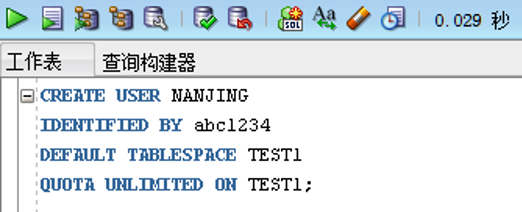

使用上述语句创建一个名叫“NANJING”的用户，登陆密码为abc1234，为其制定默认表空间为test1。在创建用户前需要保证TEST1表空间存在，如果不存在可以使用OEM工具或者`CREATE TABLESPACE`语句创建表空间。同时使用OEM工具也能生成创建表空间的SQL语句。

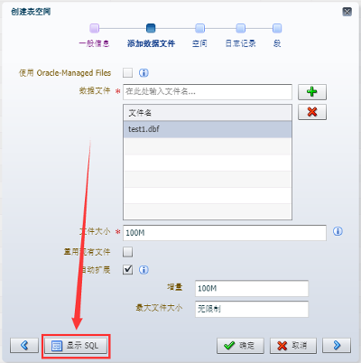
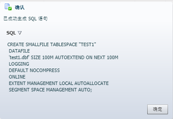

运行语句创建表空间以及用户。创建成功后在Oracle中尝试登陆该用户，发现该用户并不能正常登陆，原因是缺少连接数据库的权限（create session）。在后面的章节会详细讲解。

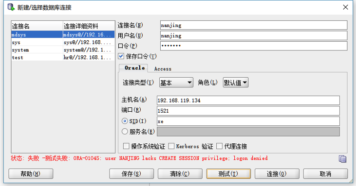

## 2. 修改用户
在前面的实验中已经介绍过，如果需要对用户的登陆口令进行修改可以使用ALTER USER命令。例如：

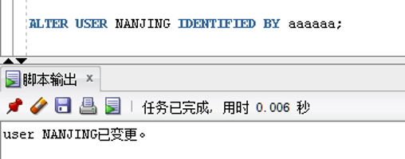

同样可以使用`ALTER USER`语句修改默认表空间、临时表空间与锁定解锁用户。

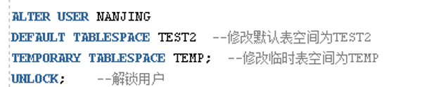

## 3. 删除用户

在Oracle数据库中使用DROP USER语句来删除用户。如果该用户还创建了对象比如表，则必须使用CASCADE关键字来级联删除。

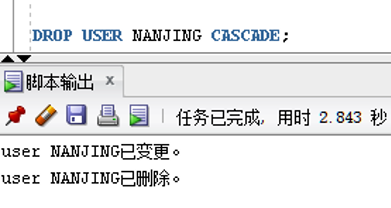

## 4. 系统权限
在Oracle中常用的系统权限与说明如下表：

|系统权限|说明|
|--|--|
|CREATE SESSION|连接数据库|
|CREATE TABLESPACE|创建表空间|
|LTER TABLESPACE|修改表空间|
|DROP TABLESPACE|删除表空间|
|CREATE USER|创建用户|
|ALTER USER|修改用户|
|DROP USER|删除用户|
|CREATE TABLE|创建表|
|CREATE ANY TABLE|在任何用户模式中创建表|
|DROP ANY TABLE|删除任何模式中的表|
|ALTER ANY TABLE|修改任何模式中的表|
|SELECT ANY TABLE|查询任何模式中基本表的记录|
|INSERT ANY TABLE|向任何模式中的表插入记录|
|UPDATE ANY TABLE|修改任何模式中表的记录|
|DELETE ANY TABLE|删除任何模式中表的记录|
|CREATE VIEW|创建视图|
|CREATE ANY VIEW|在任何用户模式中创建视图|
|DROP ANY VIEW|删除任何模式中的视图|
|CREATE ROLE|创建角色|
|ALTER ANY ROLE|修改任何角色|
|GRANT ANY ROLE|将任何角色授予其他用户|
|ALTER DATABASE|修改数据库结构|
|CREATE PROCEDURE|创建存储过程|
|CREATE ANY PROCEDURE|在任何模式中创建存储过程|
|ALTER ANY PROCEDURE|修改任何模式中的存储过程|
|DROP ANY PROCEDURE|删除任何模式中的存储过程|
|CREATE PROFILE|创建配置文件|
|ALTER PROFILE|修改配置文件|
|DROP PROFILE|删除配置文件|

系统权限是针对用户来设置的，用户必须授予相应的权限才能连接到数据中进行相应的操作。

使用`GRANT`语句可以为用户赋予系统权限，例如为用户NANJING赋予登陆Oracle、创建数据表的权限。

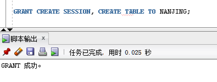

为该用户赋予权限后就可以在Oracle中登陆并创建数据表，但是没有为该用户赋予删除表的权限，因此该用户要删除数据表时会提示权限不足。

在授予权限时，可以加上一句WITH ADMIN OPTION选项，这样被授予权限的用户或角色还可以将该系统权限授予其他用户或角色。例如GRANT CREATE SESSION, CREATE TABLE TO NANJING WITH ADMIN OPTION; 

使用REVOKE语句可以将赋予用户的权限撤销，例如撤销NANJING用户的登录权限：

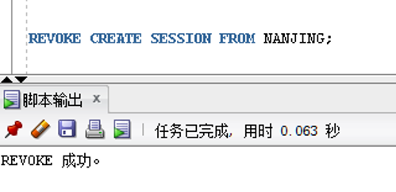

运行成功后就无法重新登陆NANJING用户了。

## 5. 对象权限
对象权限指访问其他对象的权力，用户可以直接访问自己方案下的对象。它同时指用户可以直接访问自己的对象的操作权限，如对某张表的插入、修改和删除等操作。

用户可以对自己创建的表具有所有权限，可以登陆NANJING用户进行创建表、插入数据查询等操作。

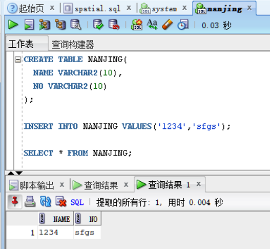

但是如果要使用NANJING用户查询其他用户下创建的表，例如system用户下的states表，就会出现下列错误：

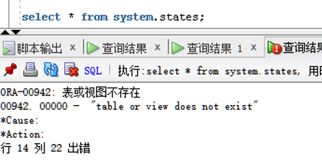

因为NANJING用户没有对system.states表的操作权限，所以需要对其授权，进入system用户，输入下列语句，为NANJING用户赋予system.states表select的权限：

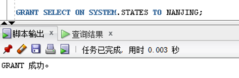

授予成功后再次进入NANJING用户，再次运行select语句，即可查询成功。

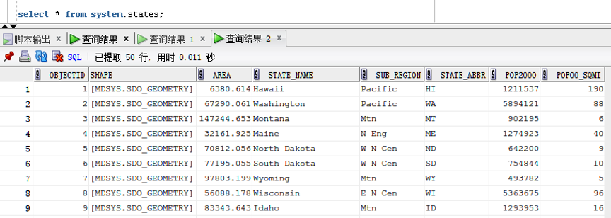

除了select，同样也可以给用户赋予alter、insert、update、delete等权限。

同样使用REVOKE语句可以撤销对用户的授权，例如撤销NANJING用户对system.states表的select权限。

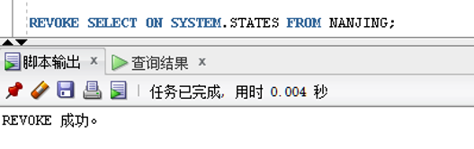

## 6. 角色
Oracle中的权限比较多，利用GRANT命令为用户分配权限是一件非常耗时的工作，为了方便用户权限的管理，Oracle数据库允许将一组相关的权限授予某个角色，所以角色是一组权限的集合。

在Oracle中，可以首先创建一个角色，该角色包括多种权限；然后将角色分配给多个用户，从而最大程度上实现复用。

在之前的实验中介绍过，Oracle有三个常用的默认权限，分别是CONNECT、RESOURCE和DBA。

与创建用户类似，使用CREATE ROLE创建角色，同样也可以使用GRANT和REVOKE对角色授予或撤销权限。登陆system用户创建角色如下：

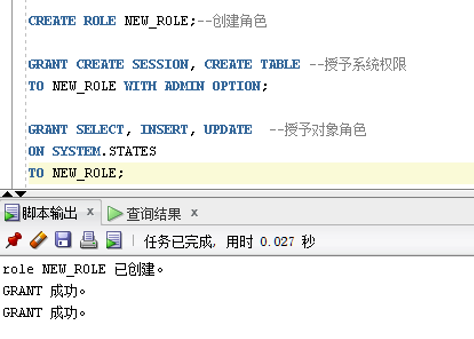

使用GRANT语句可以将上面新建的角色授予某位用户，这样用户就具有了角色中预设的所有权限。

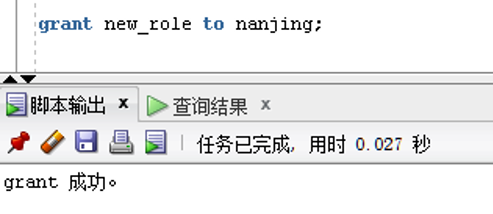

如果某个角色不再需要了，可以使用DROP语句删除该角色。

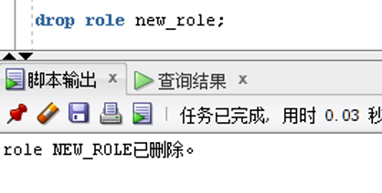

## 7. 课后作业

使用SQL语句创建一个与自己姓名汉语拼音相同的账户，密码为你的学号。为此用户授予连接数据库、创建数据表、删除数据表的系统权限，同时再system用户下创建一张student表，表结构任意，为你的用户授予这张表的增删改查的对象权限。将上述权限创建为一个角色，再创建一个用户，将其指定为上述角色。尝试使用创建的用户登录Oracle Enterprice Manager，看看能否进入OEM控制台。如果不能，根据系统提示为其添加相应权限，尝试登录。
