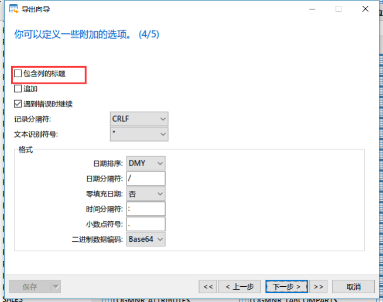

# 实验12 Oracle数据的导入与导出

## 1. 使用SQL Developer导出数据

首先创建一张数据表，数据任意。

点击刷新按钮后可以再左侧资源栏中找到这张表，右键选择导出。
首先选择以csv格式导出，如图进行以下设置

点击下一步完成数据导出的操作，等待片刻，在制定的文件目录下就生成了数据文件。其中csv文件是数据文件，可以用excel打开

另外导出工具还生成了两个sql文件，其中STUDENT.sql文件是这张表的建表语句，如需恢复数据可以使用这段语句重新建立数据表。

上述方法可以将数据导出为csv通用格式的文件供其他程序使用。如果需要从一个数据库导入数据至另一个数据库使用csv就不太方便，这种情况我们可以使用insert语句的格式来导出数据。在数据导出对话框中进行如下配置。

点击完成后再指定目录下出现一个sql文件，点击打开可以看到，该文件保留了数据表的建表语句以及插入数据，如需备份数据表，再SQL Developer或者SQL Plus下运行该代码即可。

## 2. 使用SQL Developer导入数据
如果导出的数据是insert格式，则导入数据可以直接运行sql脚本即可。如果是其他格式，则可以使用导入工具导入。首先在excel中创建一个csv的数据。

现在需要将上述数据集导入到Oracle数据库中。首先我们新建一张空数据表student1，这张表与csv文件中的数据列保持一致。

点击刷新按钮后可以再左侧资源栏中找到这张表，右键选择导入数据。

打开刚刚创建的csv文件

数据预览、导入方法默认即可

在选择列界面将所有列全部选中到右侧，点击下一步。

此时需要对列进行匹配，将数据表中的各列与csv文件中的各列相匹配，此处因为二者列名完全相同，因此默认已完全匹配，如果列名不同，则需要手动选择。

全部设置完后点击下一步完成即可。稍等片刻数据已经全部导入到数据表中了。

## 3. 在Navicat中导入导出数据
在navicat中找到要导出的数据表，点击右键选择导出向导，在向导中可以选择导出的数据格式。

点击下一步设置导出数据的路径

勾选包含列标题，点击下一步完成向导开始导出。

使用导出Navicat工具也可以导出为insert格式的数据，但是生成的SQL文件并不会自带建表语句。但是使用Navicat可以使用转储sql文件来同时保留建表语句与insert语句。在要导出的数据表上点击右键，选择转储SQL文件->结构和数据，直接指定保存路径即可。

使用Navicat导入数据也类似，使用导入向导，操作与SQL Developer类似。

导入模式可以选择是否需要将原来的数据删除。

点击下一步开始即可完成数据的导入。

## 4. 课后作业
练习导入导出数据表，尝试使用其他格式导入导出数据，数据源任选之前实验创建的数据表。
