# 实验3  SQL*Plus基本操作

## 1. SQL*Plus简介

SQL\*Plus是Oracle数据库管理员和普通用户最常用的实用程序之一,它提供一个交互式SQL语句、PL/SQL语句块和SQL*Plus命令的编辑、编译和执行环境。

## 2. 配置SQL*Plus

本节针对上次安装Oracle client失败的同学。如果能在命令行中运行sqlplus命令则可以跳过此节。

在本地机上配置SQLplus需要下载instantclient_12_2.zip文件。将其解压到一个英文目录下，这里将其放在H盘根目录下。进入到解压出来的文件夹中，在空白处**按住Shift键点击右键**。

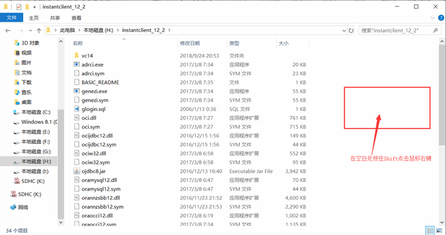

在弹出框中点击“在此处打开Powershell窗口”（Win10系统），如果是早期版本的Windows操作系统这里可能是“在此处打开CMD窗口”或者“在此处打开命令提示符”。

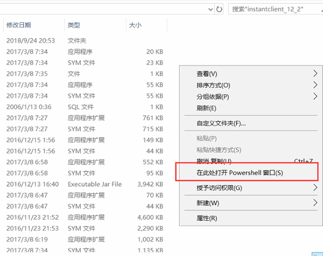

启动命令行即可输入命令登陆Oracle。该命令与实验1中使用SQL*Plus登陆Oracle类似，不过需要在命令前加上 .\ （注意斜杠的方向）。使用SQL*Plus登陆Oracle的完整命令如下： `.\sqlplus system/oracle@192.168.112.130:1521/xe` 。命令中各参数的意义参考实验1。

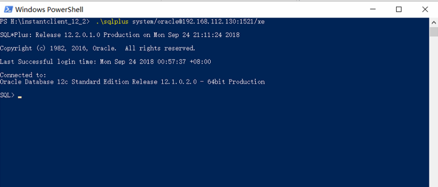

每次运行sqlplus命令时需要进入该文件夹，使用命令行将其开启。同时也可以通过设置环境变量的方式简化上述操作。*下列操作不是必须，如果不想配置环境变量，可以忽略本节接下来的内容*。

在系统的搜索栏搜索“环境变量”关键字，启动“编辑系统环境变量”窗口。

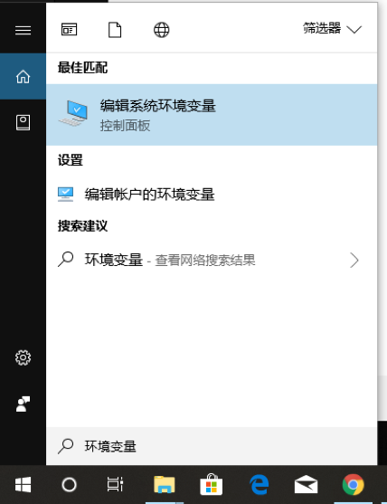

点击“环境变量”按钮。

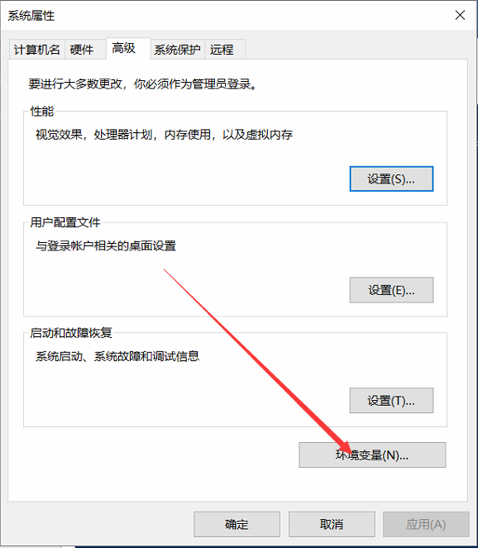

选择用户变量中的“Path”，选择编辑。

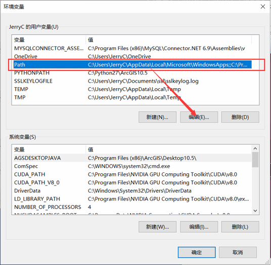

进入下列界面，点击新建，创建一条新的环境变量。

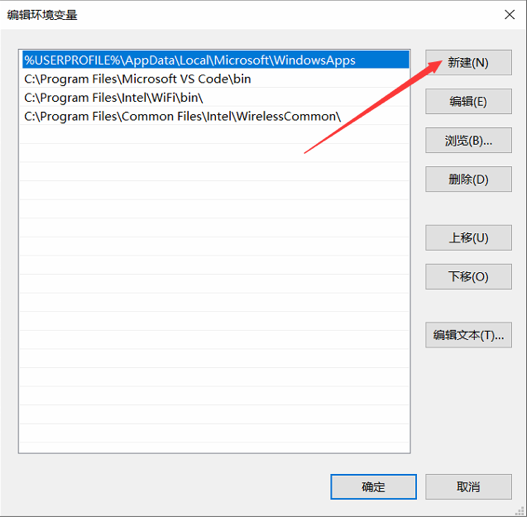

将之前解压的目录的路径复制到新建的环境变量中。

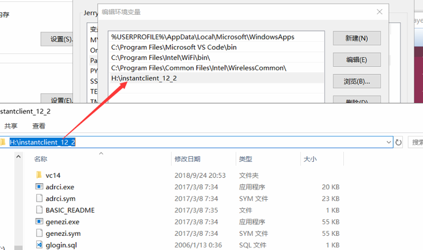

点击确定保存退出环境变量配置界面。在开始搜索Powershell或者cmd进入命令行模式直接输入`sqlplus`命令即可使用SQL*Plus连接Oracle数据库。

## 3. SQL*Plus连接与断开数据库

使用SQL*Plus连接数据库在之前的实验中已经介绍过，在此不再赘述。首先使用system用户登陆Oracle，使用`show user`命令可以查看当前登陆的用户名。

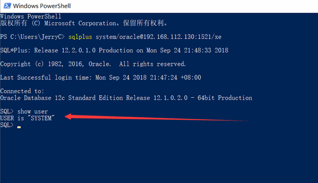

用户在登陆后可以使用connect命令再使用其他用户登陆。例如此时使用hr用户登陆该数据库，即输入： `connect hr/oracle@192.168.112.130:1521/xe`，点击回车，提示Connected表示已经连接成功。此时再使用`show user`命令查看当前登陆的用户，已变为hr。

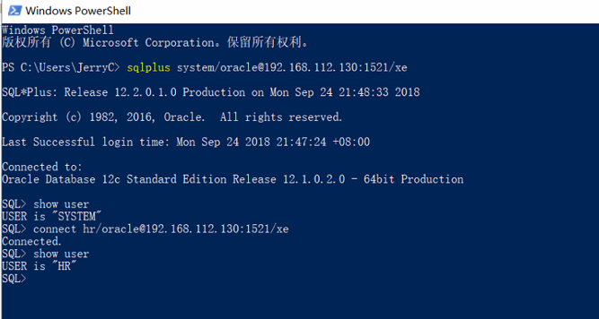

使用`disconnect`命令可以退出当前用户的登陆，断开连接后再使用`show user`命令将提示当前登陆的用户为空。此时可以再次输入`connect`命令连接数据库。

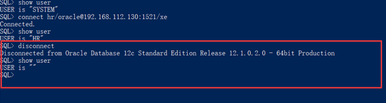

输入exit可以退出SQL*Plus的交互界面。

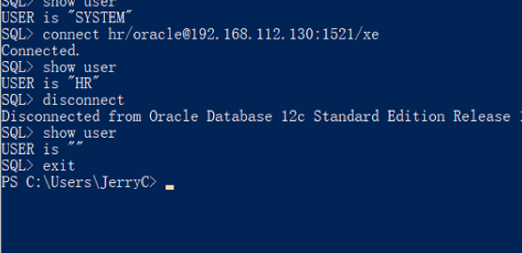

## 4. 修改账户登录口令

首先登陆数据库，输入`password`命令即可修改当前用户的登陆口令。例如此处使用system用户登录，将其登陆口令修改为1234，首先验证旧密码，然后两次输入新密码即可。（注意此处输入密码并不会显示任何提示）

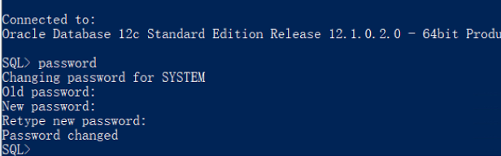

此时退出登陆后可以使用新密码再登陆数据库。

## 5. 使用SQL*Plus命令

使用`help`命令可以查询帮助文档。首先输入`help index`可以列出所有的帮助文档目录。可以通过使用help [topic]的格式来获取帮助。例如我需要得知password命令如何使用，在命令行中输入`help password`即可。

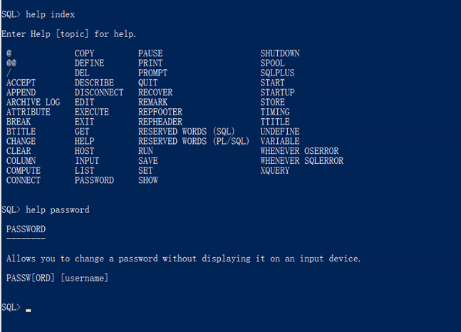

在SQL*Plus的许多命令中，用户使用的最频繁的命令可能就是`describe`命令了，它可以返回数据库中所有存储对象的描述，对于表、视图来说，describe命令可以列出其各个列的名称以及各个列的属性。例如需要输出hr.employees表的描述，则输入`describe hr.employees`，返回了关于该表列的信息，包括列名、是否能为空、数据类型等。

当执行完一条SQL语句后，该语句会被存入缓冲区，而把以前存在缓冲区的语句覆盖，使用save命令可以将缓冲区的内容保存到文件中。例如先运行了一行查询语句：`select EMPLOYEE_ID,JOB_ID,SALARY from hr.employees; `，使用`save h:\test.sql`命令即可将上述的语句保存到文件中。Save后跟的是要保存的文件的目录，这里保存在h盘根目录。

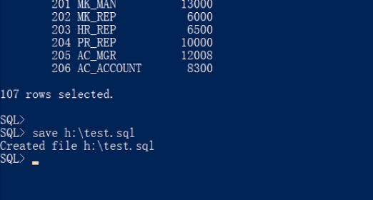

使用文本编辑器打开保存的文件内容如下：

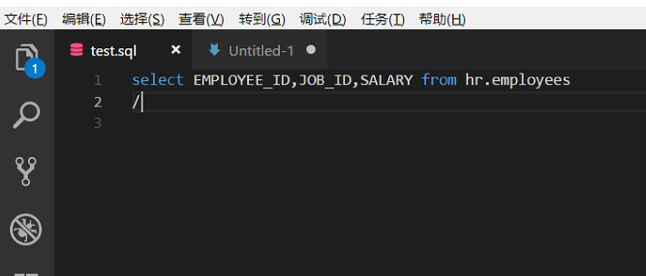

再运行一次代码，如果在指定的目录下已经存在该文件，那么便会报错，提示文件已存在。可以通过添加参数的方式处理该异常，例如`save h:\test.sql replace` 将会建立新文件覆盖原文件，`save h:\test.sql append`将会在文件后追加新的语句。

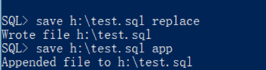

使用`edit`命令可以对上一次的在缓存中输入进行编辑，可以修改上一次输入的错误。执行命令后会使用记事本打开一个文件，在里面可以对其进行编辑，编辑完保存修改即可。

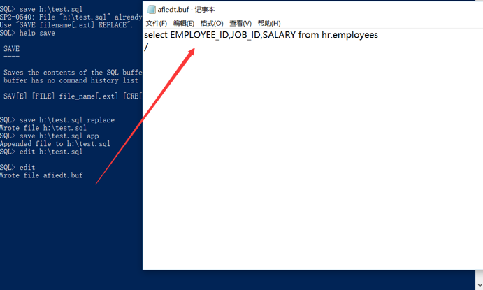

保存后输入一个斜杠运行上一次（修改后的）语句

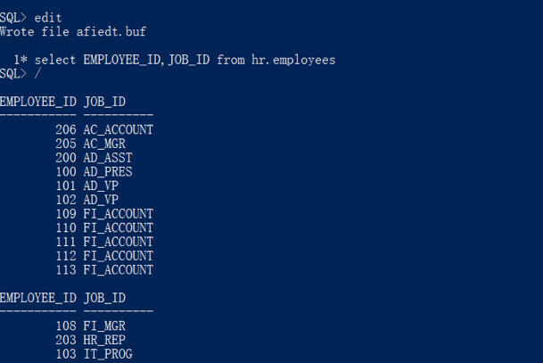

使用`spool`命令可以将SQL*Plus中输出的结果复制到一个制定的文件中，直到使用`spool off`为止。首先需要使用spool命令创建一个文件 `spool h:\spool_test.txt` 。和save命令类似，spool命令后也可加上`replace`或者`append`来表示对文件进行覆盖或追加。然后执行一个查询语句，例如 `select * from hr.employees;`

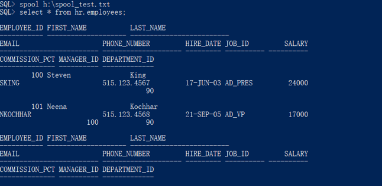

最后执行`spool off`来关闭文件流。

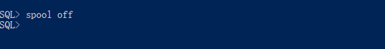

用文本编辑器打开保存在磁盘的文件，显示如下：

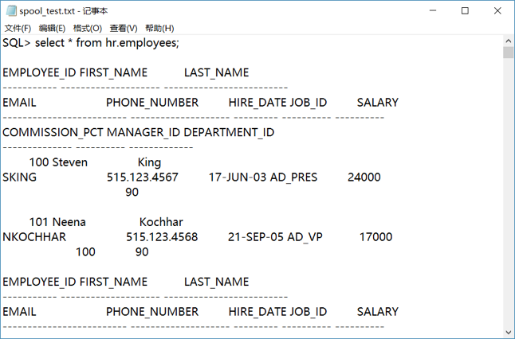

用户没有必要在每次都编写一串相同的sql代码，而可以将其保存在脚本文件中，例如上面保存的test.sql文件。在SQL*Plus中可以通过命令来反复执行脚本文件。使用`start`或者@命令运行脚本文件。格式为`@h:\test.sql` 或者`start h:\test.sql`

Start与@等价，后面跟上文件的路径。运行结果如下：

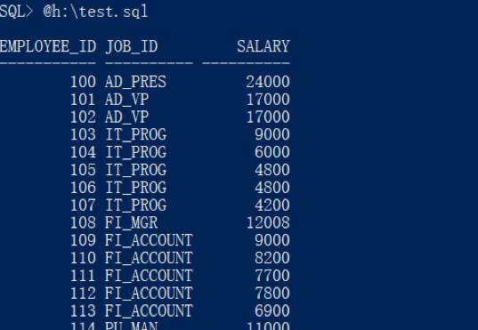

使用start或者@命令可以运行任何编辑好的脚本文件，例如创建一个文本文件，输入下列代码，使用@命令在SQL*Plus中运行。

    describe hr.employees;
    select EMPLOYEE_ID from hr.employees;

运行结果如下，脚本会按照顺序依次运行所有的命令，直到文件结束。

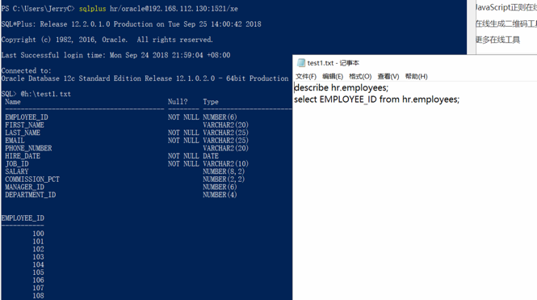

## 6. 格式化输出查询结果

有时候默认的输出格式不够美观，因此需要设置页大小，设置一页最多50行，每行150个字符容量，使用`set pagesize 50` 和 `set linesize 150`命令，设置完成后运行`select EMPLOYEE_ID, FIRST_NAME, SALARY from hr.employees; `即可查看到结果。

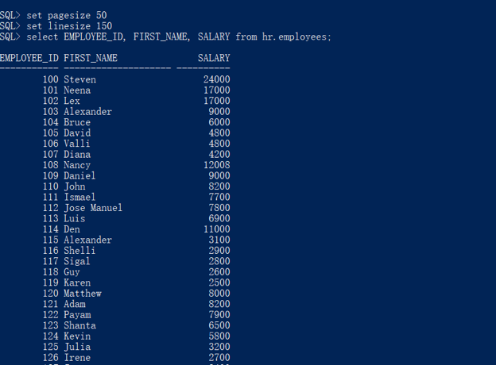

SQL*Plus还可以设置列的格式。如下例

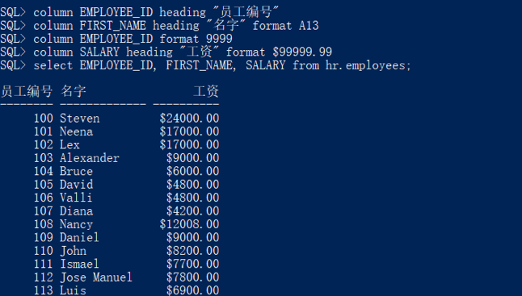

使用`column`命令对列进行修改，将EMPLOYEE_ID替换成“员工编号”，使用format为列添加格式，A13是将列设为13个字符宽，$99999.99是在工资前加上美元符号，并保留两位小数。

使用`clear columns`命令可以清除上述对列格式的设置。

## 7. 创建简单报表

所谓报表就是通过表格、图表来动态显示数据。在SQL*Plus中使用ttitle和btitle分别设计报表的页眉和页脚。

例如：`ttitle right "日期: "_date center "员工工资表" left "页"sql.pno`

上述命令创建了一个页眉，在左边是页码，在中间是字符串员工工资表，在右边是创建日期。设置完页眉后运行一条select语句如下：

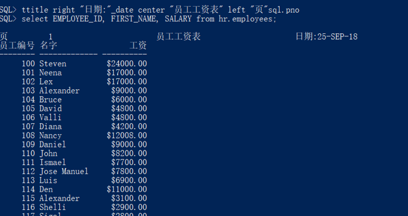

同样页脚也使用类似的方式添加：

`Btitle center "谢谢您的使用" right "制作人："sql.user`

在页脚中间添加“谢谢您的使用”字段，右侧放置制作人信息。结果如下：

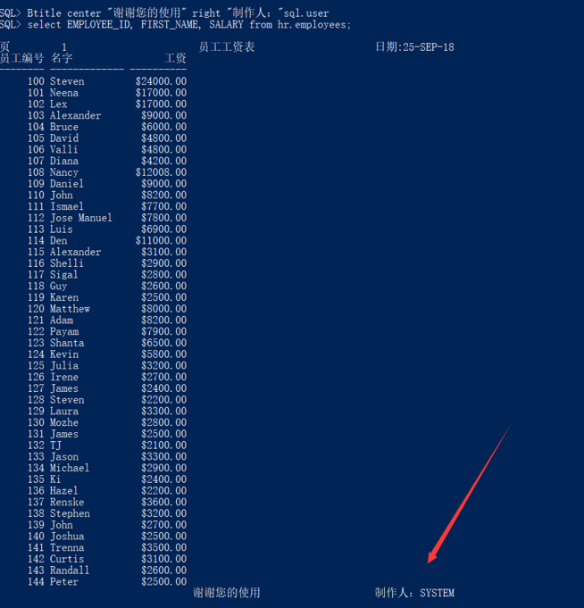

## 8. 课后作业

下面是一段查询语句，使用hr用户登录Oracle，从hr用户的employees表中选择员工id、员工名字、邮箱、雇佣日期、员工工资等信息。

    select EMPLOYEE_ID, FIRST_NAME, EMAIL, HIRE_DATE, SALARY 
    from hr.employees;

要求：
- 使用SQL*Plus的命令输出一张报表
- 设置列宽、格式，添加页眉页脚，页眉页脚的信息自定义
- 将报表使用spool命令输出为文本保存到磁盘文件中
- 将上述脚本编辑为一个sql文件，在SQL*Plus中运行
