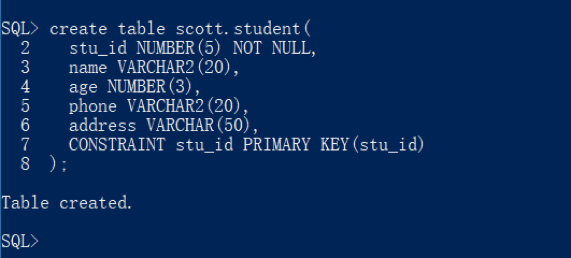
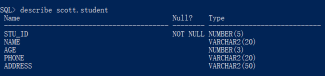
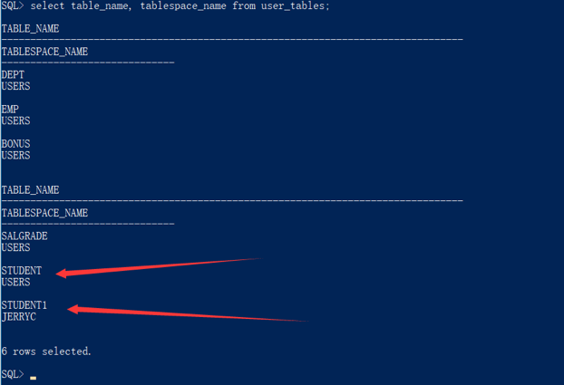
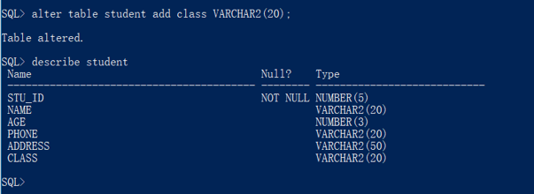
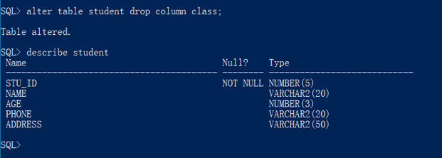
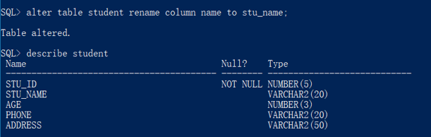
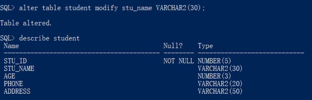
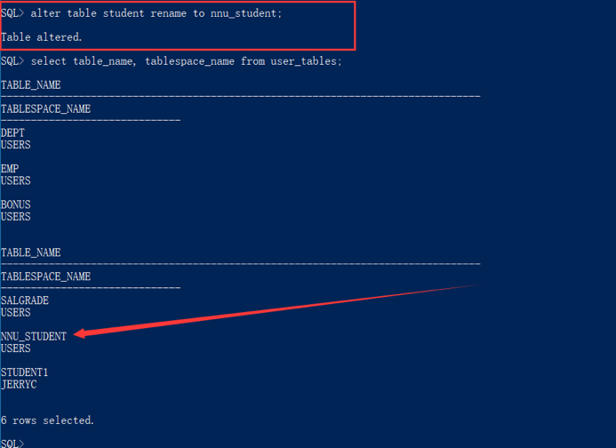
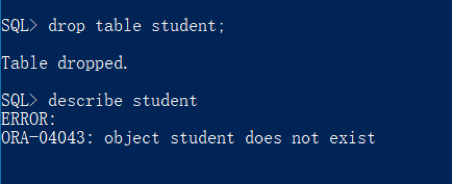

# 实验4  SQL数据定义语言（DDL）

## 1. SQL数据定义语言简介

表是最常用的模式对象，也是最重要的数据库对象之一。为了能够保证数据库内数据的有效性和完整性，在使用表时，需要掌握表的一些最基本的操作，包括表的创建、修改以及对于表的完整性进行约束等。

## 2. Oracle的数据类型

在Oracle数据库中，表是基本的数据存储结构。表是由行和列组合而成的。其中，行表示表中的数据记录信息，列则是表的字段信息，这些字段是由类型、主键、外键、索引等属性组成的。本书将详细介绍如何在Oracle中创建表。在介绍如何创建表之前，首先需要了解Oracle数据库中有哪些数据类型。下表列出了Oracle部分常用的数据结构：

|数据类型|参数|描述|
|--|---|----|
|char(n)|n=1 to 2000字节|定长字符串，n字节长，如果不指定长度，缺省为1个字节长（一个汉字为2字节），单位是字节|
|nchar(n)|n=1 to 2000字节|根据字符集而定的固定长度字符串，最大长度2000字节,单位是字符（一个汉字为一个字符）|
|varchar2(n)|n=1 to 4000字节|可变长的字符串，具体定义时指明最大长度n，这种数据类型可以放数字、字母以及ASCII码字符集(或者EBCDIC等数据库系统接受的字符集标准)中的所有符号。 如果数据长度没有达到最大值n，Oracle 8i会根据数据大小自动调节字段长度，如果你的数据前后有空格，Oracle 8i会自动将其删去。VARCHAR2是最常用的数据类型。 可做索引的最大长度3209。|
|nvarchar2(n)|n=1 to 4000字节|根据字符集而定的可变长度字符串，最大长度4000字节|
|number(m,n)|m=1 to 38 n=-84 to 127|可变长的数值列，允许0、正值及负值，m是所有有效数字的位数，n是小数点以后的位数。 如：number(5,2)，则这个字段的最大值是999.99，如果数值超出了位数限制就会被截取多余的位数。 如：number(5,2)，但在一行数据中的这个字段输入575.316，则真正保存到字段中的数值是575.32。 如：number(3,0)，输入575.316，真正保存的数据是575。|
|date|无|从公元前4712年1月1日到公元4712年12月31日的所有合法日期，Oracle 8i其实在内部是按7个字节来保存日期数据，在定义中还包括小时、分、秒。缺省格式为DD-MON-YY，如07-11月-00 表示2000年11月7日。|
|long|无|可变长字符列，最大长度限制是2GB，用于不需要作字符串搜索的长串数据，如果要进行字符搜索就要用varchar2类型。 long是一种较老的数据类型，将来会逐渐被BLOB、CLOB、NCLOB等大的对象数据类型所取代。|
|raw(n)|n=1 to 2000|可变长二进制数据，在具体定义字段的时候必须指明最大长度n，Oracle 8i用这种格式来保存较小的图形文件或带格式的文本文件，如Miceosoft Word文档。 raw是一种较老的数据类型，将来会逐渐被BLOB、CLOB、NCLOB等大的对象数据类型所取代。|
|long raw|无|可变长二进制数据，最大长度是2GB。Oracle 8i用这种格式来保存较大的图形文件或带格式的文本文件，如Miceosoft Word文档，以及音频、视频等非文本文件。 在同一张表中不能同时有long类型和long raw类型，long raw也是一种较老的数据类型，将来会逐渐被BLOB、CLOB、NCLOB等大的对象数据类型所取代。|
|blob clob nclob|无|三种大型对象(LOB)，用来保存较大的图形文件或带格式的文本文件，如Miceosoft Word文档，以及音频、视频等非文本文件，最大长度是4GB。 LOB有几种类型，取决于你使用的字节的类型，Oracle 8i实实在在地将这些数据存储在数据库内部保存。 可以执行读取、存储、写入等特殊操作。|
|bfile|无|在数据库外部保存的大型二进制对象文件，最大长度是4GB。 这种外部的LOB类型，通过数据库记录变化情况，但是数据的具体保存是在数据库外部进行的。 Oracle 8i可以读取、查询BFILE，但是不能写入。 大小由操作系统决定。|

## 3. 创建数据表

使用create table语句来创建数据表，其语法规则如下：

    create table [schema.] table_name(
        column_name data_type [default expression] [constraint]
        [,column_name data_type [default expression] [constraint]]
        [,column_name data_type [default expression] [constraint]]
        [,…]
    );

例如：

    create table scott.student(
        stu_id NUMBER(5) NOT NULL,
        name VARCHAR2(20),
        age NUMBER(3),
        phone VARCHAR2(20),
        address VARCHAR(50),
        CONSTRAINT stu_id PRIMARY KEY(stu_id)
    );

如果没有语法错误，那么运行后结果如下，创建成功：

表创建成功后可以使用describe命令查看表结构。

使用`create table`命令创建数据表时是将其存放在指定用户的默认表空间中。有时建表时不一定要存放在默认表空间中，可以指定存放该表的表空间，需要使用tablespace语句。在建表语句后追加如下内容，指定该表存放的表空间为jerryc（实验2创建的）。

    create table scott.student1(
        stu_id NUMBER(5) NOT NULL,
        name VARCHAR2(20),
        age NUMBER(3),
        phone VARCHAR2(20),
        address VARCHAR(50)
    ) TABLESPACE jerryc;

如需查看表与表空间的对应关系，可以运行语句

    select table_name, tablespace_name from user_tables;

从结果中可以看出，student表是存放在scott用户默认的表空间users中，而student1表存放在指定的jerryc表空间中。

## 4. 修改数据表

创建一个数据表后可以再对数据表进行修改操作，包括增加和删除列、更新列、重命名表等。

使用alter table… add命令可以向表中增加列。例如需要向student表中新增一列class，类型为VARCHAR2(20)，编写代码如下：

    alter table student add class VARCHAR2(20);

执行代码后运行describe命令查看表结构描述：

可以看到已经新增了一个class列。

在表中如需要删除已存在的列，需要使用`alter table…drop column;`语句，例如需要将上面新建的class列删除，需要使用命令：

    alter table student drop column class;

执行代码后运行describe命令查看表结构描述：

使用`alter table... rename... to ...`语句可以修改某列的列名。下列代码是将student表中name列的列名修改为stu_name。

    alter table student rename column name to stu_name;

运行如下：

使用alter table… modify…可以对某列的数据类型进行修改，但是在数据类型修改时需要注意两点：
1. 一般情况下，只能将数据的长度由短向长改变，而不能由长向短改变。
2. 当表中没有数据时，可以将长度由长向短改变，也可以把某种类型改为另一种类型

将stu_name列的类型改为VARCHAR2(30)。

    alter table student modify stu_name VARCHAR2(30);	

运行如下：

使用`alter table … rename to`语句可以修改表名。例如将表student的表名修改为nnu_student：

    alter table student rename to nnu_student;

运行成功后使用`select table_name, tablespace_name from user_tables;`查看表名。

此时需要使用describe nnu_student命令才能查看新表的结构。

## 5. 表的完整性约束

数据库的完整性是指数据库中数据的完整性与相容性，为了能保证数据库插入数据具有完整性，通常情况需要使用各种完整性约束。

**非空约束**表示某列的值是不可缺少的，使用NOT NULL关键字即可定义非空列。在创建表时可以在列定义后加上NOT NULL关键字进行约束。如下例，stu_id与name列都被定义为非空，添加非空约束后这两列在插入数据时不能有空数据。

    create table scott.student(
        stu_id NUMBER(5) NOT NULL,
        name VARCHAR2(20) NOT NULL,
        age NUMBER(3),
        phone VARCHAR2(20),
        address VARCHAR(50),
        CONSTRAINT stu_id PRIMARY KEY(stu_id)
    );

对已存在的数据表可以通过使用alter语句添加NOT NULL约束。例如：

    alter table student modify name NOT NULL;

如果需要删除某列的非空约束，将上述语句的NOT NULL修改为NULL即可。

使用primary key定义**主键约束**，在创建表时，如果为主键约束指定名称，需要使用constraint关键字，即constraint … primary key语句。例如上面使用过的建表语句，constraint关键字后的stu_id为约束名，primary key后括号内的列名为需要建立主键的列。

    create table scott.student(
        stu_id NUMBER(5) NOT NULL,
        name VARCHAR2(20) NOT NULL,
        age NUMBER(3),
        phone VARCHAR2(20),
        address VARCHAR(50),
        CONSTRAINT stu_id PRIMARY KEY(stu_id)
    );

如果建表时不想定义主键约束的约束名，则上述代码可以简化成：

    create table scott.student(
        stu_id NUMBER(5) NOT NULL PRIMARY KEY,
        name VARCHAR2(20) NOT NULL,
        age NUMBER(3),
        phone VARCHAR2(20),
        address VARCHAR(50)
    );

唯一存在的表添加主键列可以使用alter语句：

    alter table student1 add constraint stu_pk primary key(stu_id);

上述代码使用alter语句将stu_id设为主键约束，约束名为stu_pk。注意：当表中已经存在主键约束时该语句会运行失败。

UNIQUE约束时指**唯一性约束**，用来保证表中某一列或某几列组合起来不重复。

    create table scott.student3(
        stu_id NUMBER(5) NOT NULL PRIMARY KEY,
        name VARCHAR2(20) CONSTRAINT stu_uk UNIQUE,
        age NUMBER(3),
        phone VARCHAR2(20),
        address VARCHAR(50)
    );

上述代码为name列创建了UNIQUE约束，约束名为stu_uk。
使用alter语句可以为已存在的列添加UNIQUE约束

    alter table student3 add constraint stu_uk unique(name);

**外键约束**是指引用另一张表中的某一列或某几列，外键约束的作用时让某两个表通过外键建立关系。下面使用references实现外键约束。首先创建class表，该表有班级名称与班级编号两列，定义班级编号为主键。

    create table class(
        class_no number(4) NOT NULL PRIMARY KEY,
        class_name varchar2(20)
    );

新建一张student4表，其中，class_id列需要参照class表的class_no列。

    create table scott.student3(
        stu_id NUMBER(5) NOT NULL PRIMARY KEY,
        name VARCHAR2(20) CONSTRAINT stu_uk UNIQUE,
        age NUMBER(3),
        class_id number(4) references class(class_no)
    );

该表中的class_id列引用了class表中的class_no列。引用列与被引用列的列名可以不同，但是数据类型必须一致。使用alter语句为已存在的数据表添加外键。先创建一张没有外键的表

    create table scott.student4 (
        stu_id NUMBER(5) NOT NULL PRIMARY KEY,
        name VARCHAR2(20) CONSTRAINT stu_uk UNIQUE,
        age NUMBER(3),
        class_id number(4)
    );

运行下列语句可以为student表添加外键

    alter table student4
    add constraint stu_fk foreign key(class_id)
    references class(class_no);

删除主键约束、unique约束或外键约束都可以使用alter table… drop constraint 语句。例如删除student表中名为stu_pk的主键约束可以使用下列代码：

    alter table student drop constraint stu_pk;

## 6. 删除数据表
删除数据表使用drop table语句。例如删除student表：

    drop table student;

## 7. 课后作业

#### 1. 练习在SQL*Plus与SQL Developer或者Navicat中运行SQL代码
#### 2. 使用实验2中创建的个人用户登录数据库，在实验2创建的表空间中创建以下三张数据表，数据类型自拟，合理即可：
- 学生表：Student (Sno, Sname, Ssex, Sage, Sdept)
- 课程表：Course (Cno, Cname, Cpno, Ccredit)
- 选课表：SC (Sno, Cno, Grade)

其中，学生表中Sno为主键，课程表中Cno为主键，SC表的Sno与Cno为外键，分别参照学生表与课程表的相应列。

建立数据表并编写实验报告。
