# 实验5 数据操纵语言与SQL简单查询

## 1. 数据操纵语言介绍

SQL语言共分为四大类：数据查询语言DQL，数据操纵语言DML， 数据定义语言DDL，数据控制语言DCL。其中DDL用于定义数据的结构，比如创建、修改或者删除数据库；DCL用于定义数据库用户的权限；如上次课程所述的Oracle数据定义语言DDL，本次实验操作我们将介绍数据操控语言DML的具体使用方法。

DML是SQL的一个子集，主要用于增删改查数据，下表列出了ORACLE支持的DML语句。SQL语言的常用数据操纵语句包括下表所示的命令

|语句|用途|
|--|--|
|INSERT|向表中添加行|
|UPDATE|更新存储在表中的数据|
|DELETE|删除行|

本次上机课程有关DML操作主要包括：创建新表、INSERT命令的使用、UPDATE命令的使用、DELETE命令的使用。

## 2. 插入数据

为了接下来的实验我们先创建一张数据表，该表表名为student_test，其中包含以下列：学号（stu_no）、学生姓名（name）、性别（gender）、年龄（age）、高考成绩（grade）。其中以学号为主键。

建表语句如下：

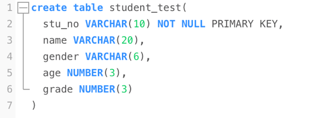

表定义好后可以在SQL Plus中使用desc命令查看表结构。

数据插入使用Insert into values语句，其语法规则如下：

    insert into table_name [(column1 [,coulmn2…])
    values(value1 [,value2…]

假设要向表中添加一条数据`（1000001,jerry,male,22,600）`，使用insert语句如下：

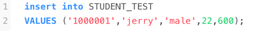

注意字符串需要使用单引号包起来。

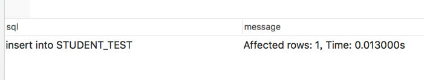

代码运行成功后会出现上述字样。此时使用select * 语句查询全表数据，即可看到数据已经成功插入。

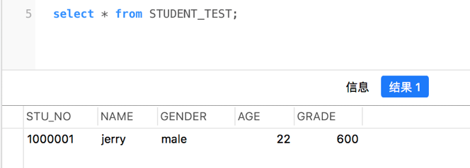

上述语句其实是insert语句的省略形式，默认对所有的列插入数据。当然，Oracle可以指定需要插入数据的列的。具体操作如下：

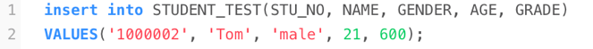

在表名后跟上一个括号指定要插入数据的列名，这样也可以插入数据。有时候并不需要向数据库中所有列都插入数据，可以通过指定列名的方法来向想要的列插入数据。例如有位同学的成绩未知，需要先添加数据后面再修改成绩，这时候insert语句就可以这样写：

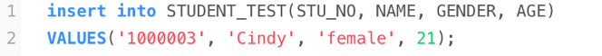

查看数据后即可发现刚刚插入的Cindy同学的成绩为空，而其他同学的成绩有数值。

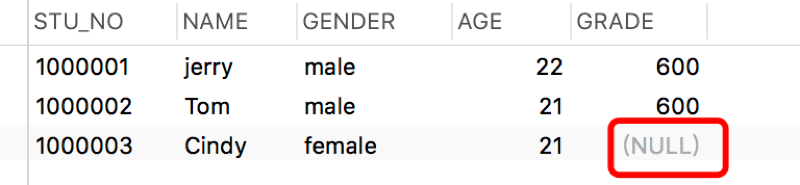

思考如果向刚刚的数据表中再插入一条stu_no为1000001的学生数据时会发生什么，尝试后将结果与思考编写进实验手册的心得部分。

## 3. 更新数据

Update语句可以对表中的数据进行修改。其具体的语法为：

    update table_name 
    set column1=expression[, column2=expression]
    [where condition]

该数据表中记录的年龄可能每年需要更新一次，可以使用update语句对全表所有人的年龄进行修改，例如给所有人的年龄增加一岁：

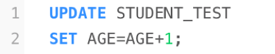

运行完毕后每人的年龄都增加一岁。

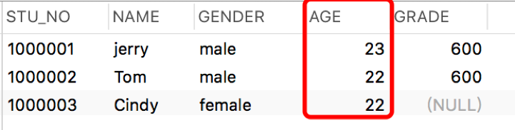

在上面的实验中Cindy同学的成绩缺失，那么可以使用update语句针对Cindy同学这一行进行插入操作，代码如下：

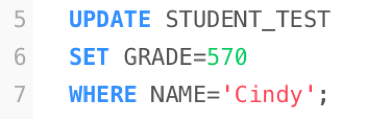

这段语句的意思是在student_test表中将Name为Cindy的那行数据的Grade列的值修改为570。运行成功后查看表：

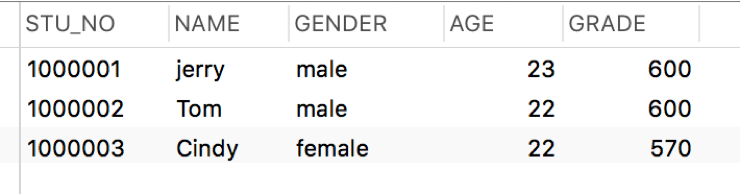

update语句中还可以进行条件的筛选，比如要给分数大于等于600分的同学再加10分，那么可以在where子语句中加入不等式的条件。

结果如下：

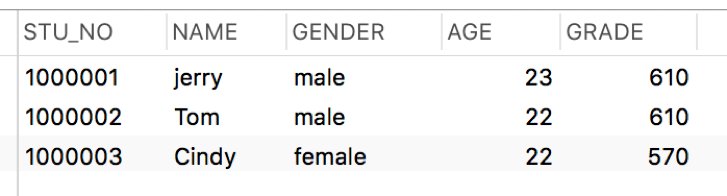

## 4. 删除数据

使用delete语句可以将数据库中的数据删除。Delete语句的语法如下：

    delete from table_name 
    [where condition]

delete操作会给数据库带来很大的风险，删除数据过程中一定要注意语句有无错误，一定要注意数据的安全。例如下面要删除stu_no为1000001的这行数据：

执行完毕后查看数据表发现数据已经少了一行。

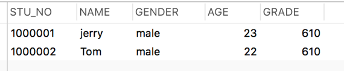

where语句中的条件与update语句中的where类似。

## 5. 简单查询

为了更好的讲述接下来的内容，往数据表中任意插入一些数据。

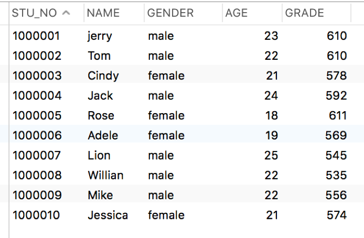

在之前的学习中我们多多少少运用到了一些查询语句，比如要查看一张表中所有的数据可以使用select * from table; 语句。那么接下来简要介绍一下SQL的select语句。Select语句的完整结构如下：

    select [all | distinct]
    {* | expression | colomn1_name [,colomn2_name]
    from {table1_name [,table2_name]
    [where condition]
    [group by expression]
    [having condition]
    [union]
    [order by expression [asc|desc]]

首先，语句中*的意思是指查询所有列，如果需要查询特定列可以在select语句中指定列名，比如查询所有人的学号与姓名：

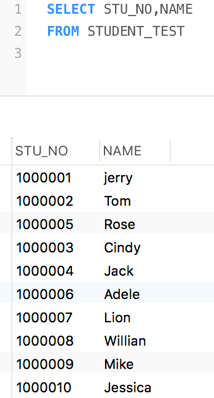

使用distinct关键字可以对结果去重：

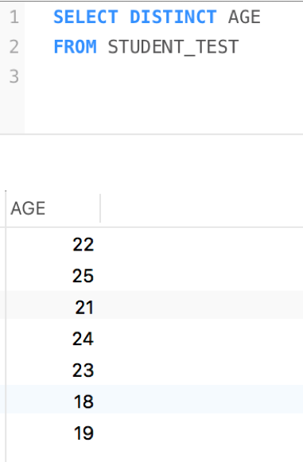

select语句中也可以使用where语句来指定过滤条件，与update、delete类似。首先where子语句中可以使用=、!=、>、<、>=、<=等操作符对数值进行比较，在update语句中有介绍，此处类似不过多赘述，同时也可以使用and、or、not等逻辑操作符对逻辑进行判断，看以下几个例子：

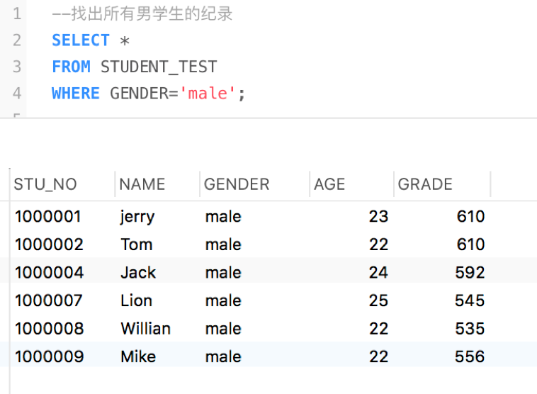
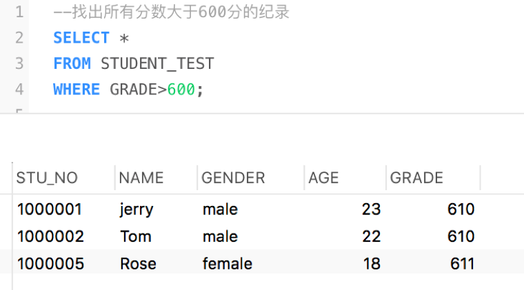
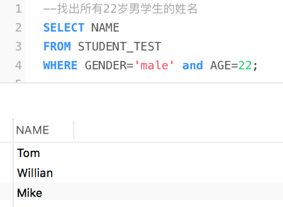
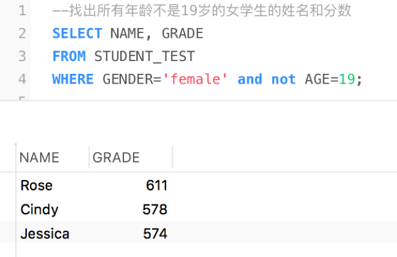

除了上述的操作符，Oracle的查询语句还支持下列的操作符：between … and … （在两值之间）、in（在列表中匹配） 、like（匹配字符串）、 is null（判断空值）。

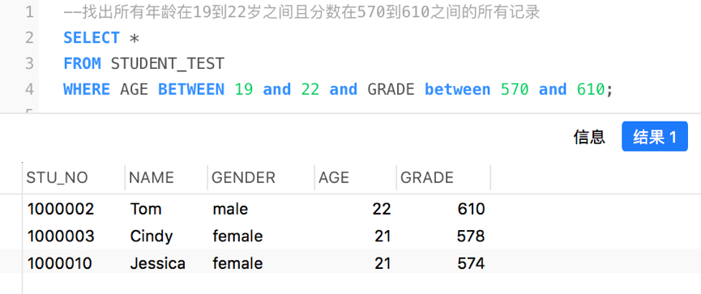
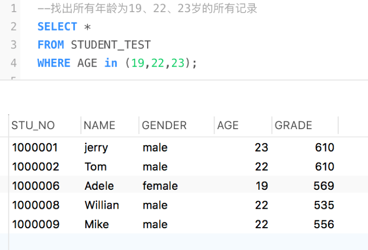
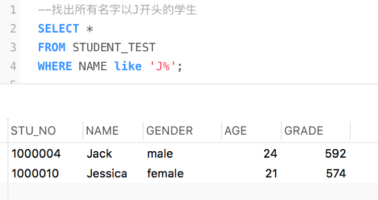

使用order by语句可以对数据进行排序
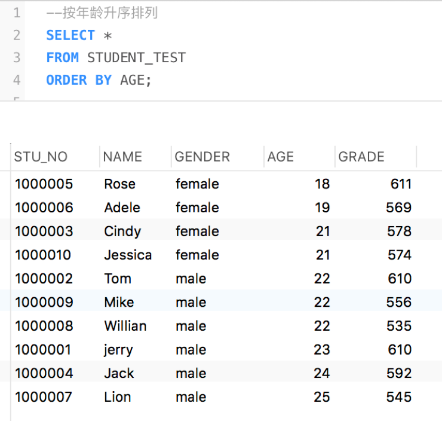
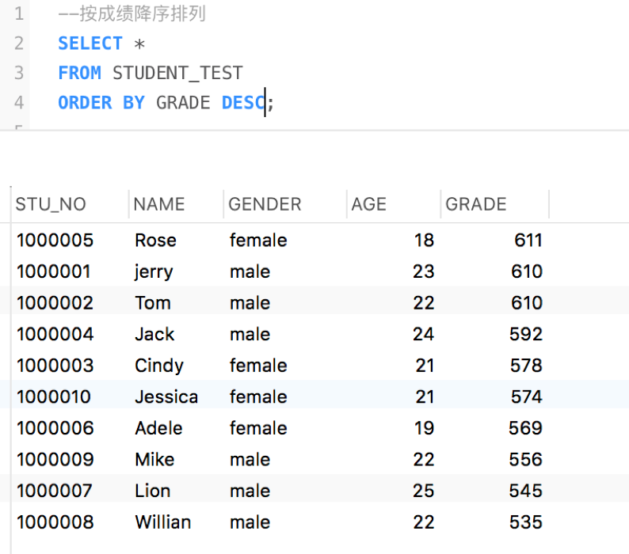
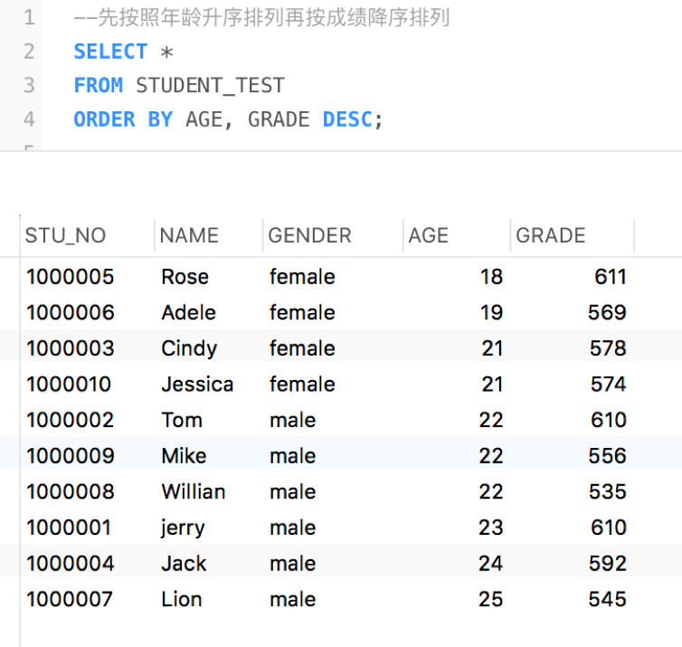

## 6. 课后作业
使用insert语句向实验4课后作业创建的3张表中任意插入一些数据，保存成SQL文件（注意表中的约束，思考数据要如何插入）。并自行练习update与delete语句。

使用HR用户自带的Employees数据表完成以下查询：

1. 查找工资高于10000美元的员工的姓名
2. 查找部门号为50中工资不足3000美元的员工的所有记录
3. 找出First name以D开头的员工并按照工资的升序排列
4. 找出Last name中有字母a员工姓名
5. 找出First name不以E开头，Last name有4个字母，部门号为30 50 80的员工
