# SQL 查询

## 1. 使用别名

可以为查询的数据列另起一个别名来提高查询结果的可读性。指定别名的方法是在列名 后先加空格，再添加列的别名。

同样的，表也可以起别名，指定表名的方法是在表名后添加空格加上表的别名，然后列 名可以用 `表别名.列名`的方式来访问。这在接下来的多表查询中会用到。

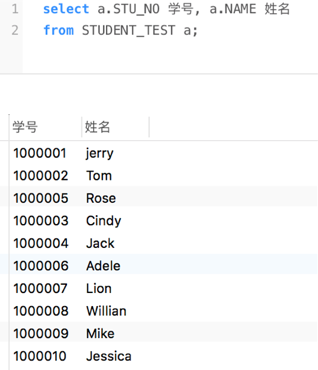

## 2. 字符串函数

在Oracle数据库函数中，字符串函数是比较常见的函数之一。在使用字符串常数时， 可以接收字符参数，这些字符可以是一个任意有效的表达式，也可以来自于表中的一列，其 返回值类型为字符类型或数值类型。下面简略介绍几个Oracle 所提供的字符串函数的应用:

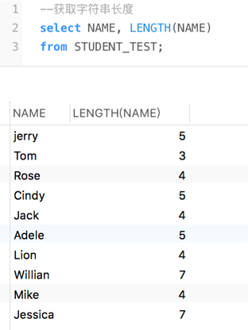

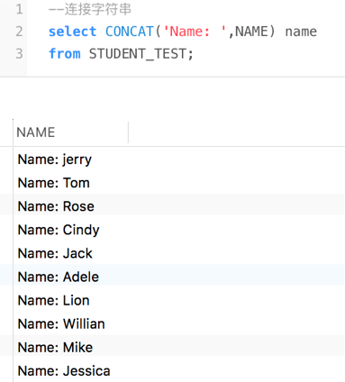

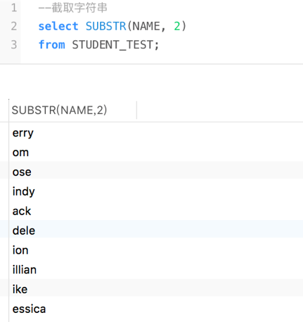

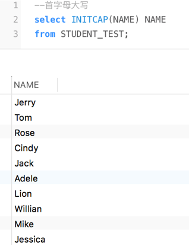

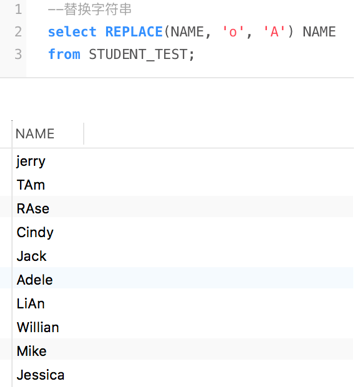

## 3. 数值函数

针对数值型数据，Oracle 提供了丰富的内置函数进行处理。数值函数的输入参数和返回 值都是数值型。下面的例子Oracle 数据库中使用的比较常见的数值函数的用法，同时数值函数不仅局限于此，更多的函数以及其用法可以参考官方文档或者网络检索。

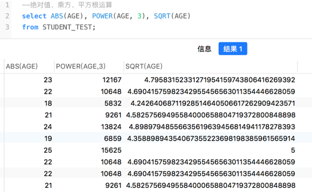

## 4. 聚集函数

检索数据不仅仅是把现有的数据简单地从表中取出来，很多情况下，还需要对数据执行 各种统计计算。在 Oracle 数据库中，执行统计计算需要使用聚合函数，常做的统计计算有 求平均值、求和、求最大值、求最小值等。这些函数在分组查询中经常用到。

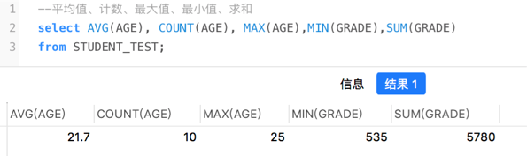

## 5. 数值计算

有了上述的函数，那么我们还可以在 select 语句中结合一些简单的函数进行数值的计算

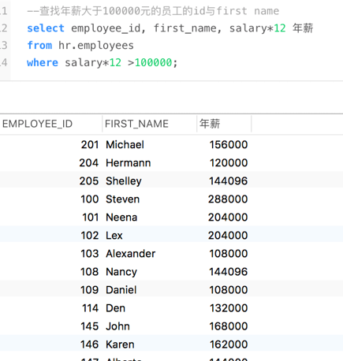

## 6. 分组查询

在数据库查询中，分组是一个非常重要的应用。分组是指将数据表中的所有记录，以某 个或者某些列为标准，划分为一组。例如，在一个存储了各个地区学生的表中，以学校为标准，可以将所有学生的信息划分为多个组。在本实验中使用的学生表也可进行分组，例如按照性别分组或者按照年龄分组等。进行分组查询需要使用 GROUP BY 子句。

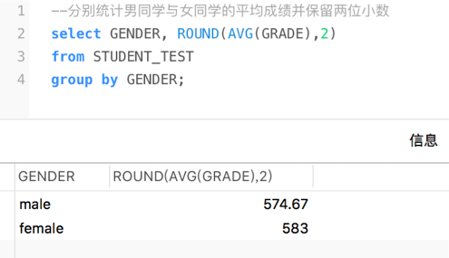

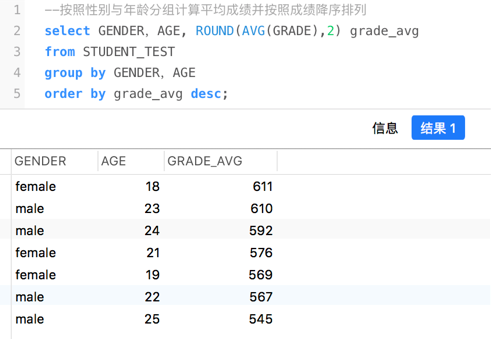

HAVING 子句通常与 GROUP BY 子句一起使用，在完成对分组结果的统计后，可以使用 HAVING 子句对分组的结果进行进一步的筛选。

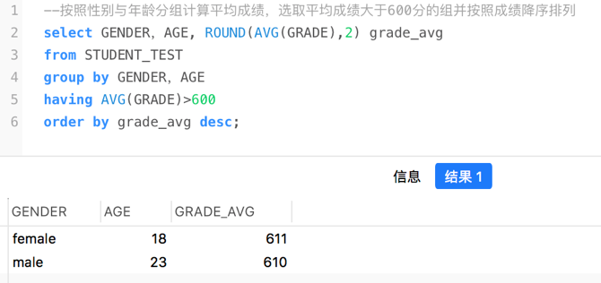

HAVING 语句与 WHERE 语句的用法是不同的，WHERE 语句是对整个数据集筛选， HAVING 语句是对分组后的结果进行筛选。而且两个字句的位置也不同，HAVING 语句必须 要跟在 GROUP BY 语句的后面，而 WHERE 语句是在 GROUP BY 的前面。而 ORDER BY 语句 永远是在 SELECT 语句的最后。

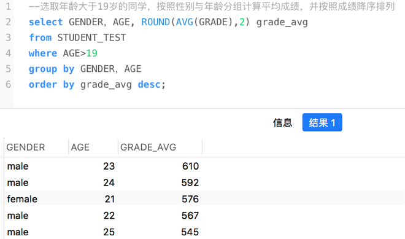

## 7. 子查询

为了方便接下来的实验，我们在 student、course 和 sc 表中插入下列数据

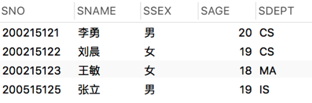

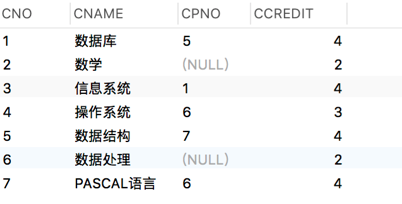

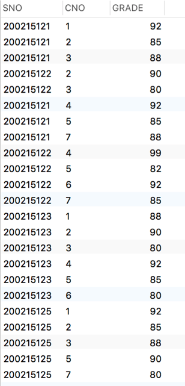

在 SELECT 语句内部使用 SELECT 语句，这个内部的 SELECT 语句就被称为“子查询”。

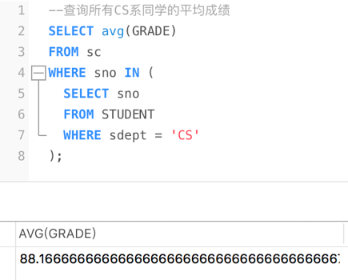

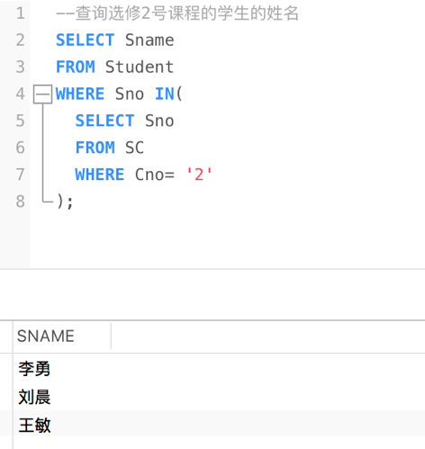

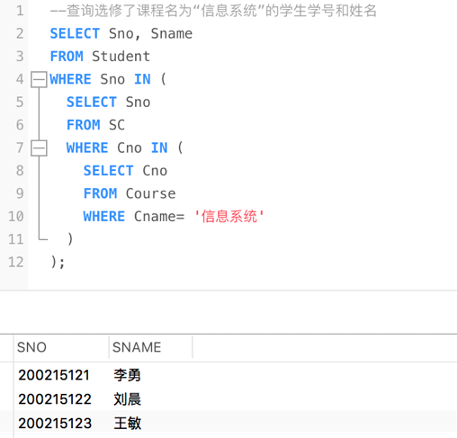

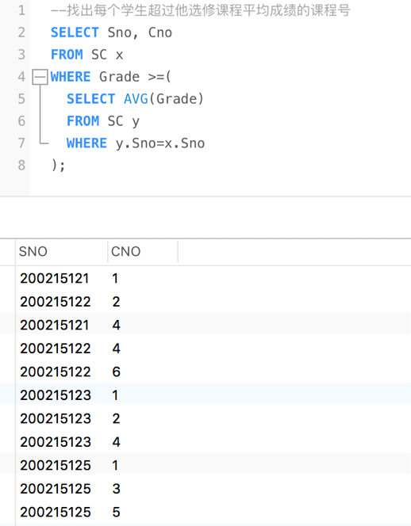

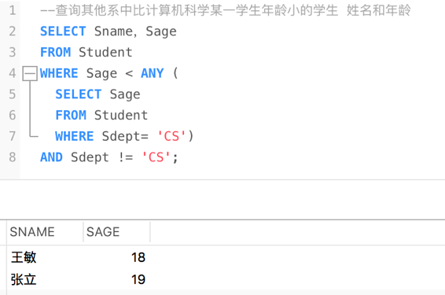

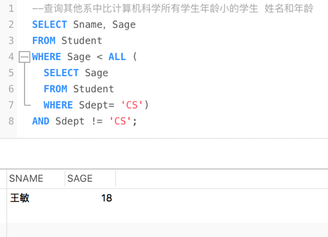

## 8. 简单连接查询

连接查询实际上是通过各个表之间共同列的关联性来查询数据的，他也是关系型数据库 查询最主要的特征。简单连接是使用逗号将两个或多个进行连接，这也是最简单、最常用的 多表查询形式。简单连接是指使用相等比较符(=)指定条件的连接查询，这种连接查询主要用于检索主从表之间的相关数据。比如下面使用简单连接查看学生的姓名和考试成绩

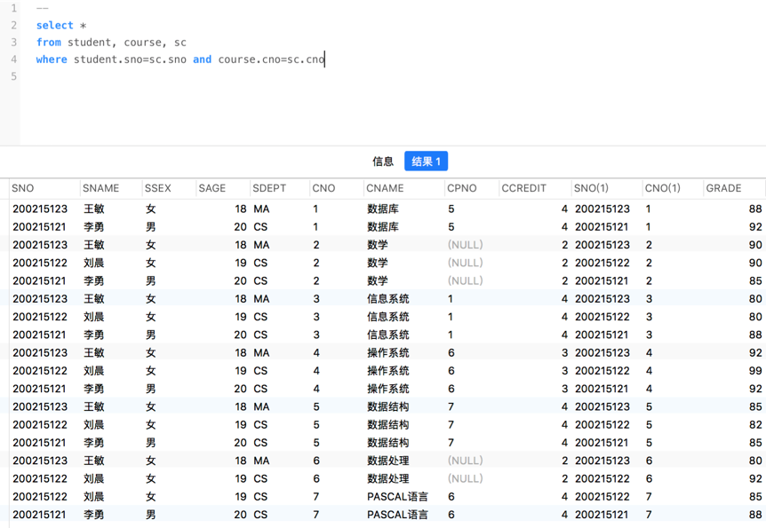

在连接查询中也可以给表起别名，指定要选择的列，另外再加一些筛选条件。

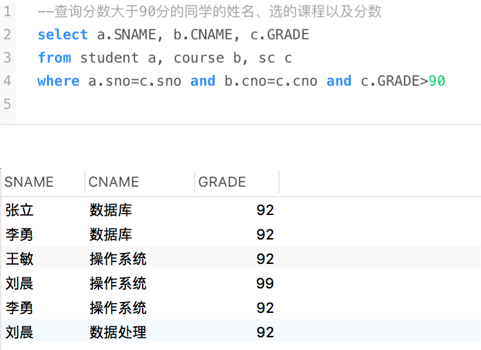

同时，连接查询也可以连接自身，在这里需要使用别名来区分前表和后表。比如每一门 课的先修课的课名

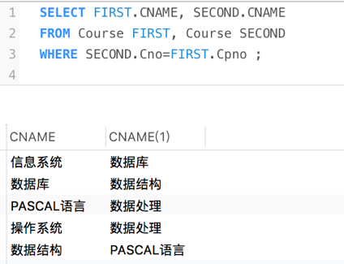

## 9. 课后作业

自行查阅相关资料，了解 Oracle 支持的字符串函数、数值函数、日期函数以及聚合函 数，并在 student 表和 hr.employees 表中做练习。

用查询语句在 HR 用户下的表中完成以下的查询:

1. 查询各部门的平均工资
2. 查询各部门的名称以及该部门的最高工资
3. 查询获得工资大于所有部门平均工资的员工信息 
4. 查询所有在Finance部门工作的员工的姓名与工资 
5. 查询月薪大于10000元的员工的姓名与工作地点 
6. 查询工资比其经理工资高的员工姓名
7. 查询哪个大洲平均工资最高*
8. 查询各部门工资最高的员工的姓名与工资**
