# 实验7 SQL查询（2）

## 1. 使用join关键字进行连接查询

连接查询是数据库中应用非常广范的查询方式，它是通过各表共同列之间的关联性来查询数据的，它是关系型数据库查询最主要的特征。为了接下来的实验说明，现在在数据库中创建一下两张数据表，test_a和test_b：

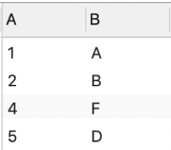

Join操作基本分为3大类：外连接(细分为：左连接、右连接、全连接)、自然连接、内连接。Join操作的共性：第一步均为将所有参与操作的表进行了一个笛卡儿积，然后才依据各连接条件进行记录的筛选。首先先对上述两张表求笛卡尔积

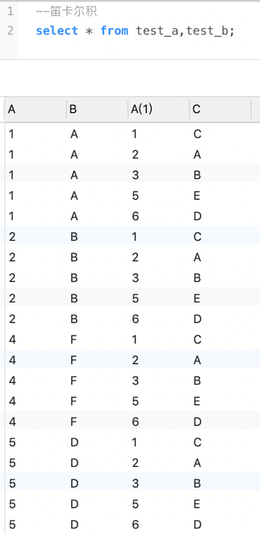

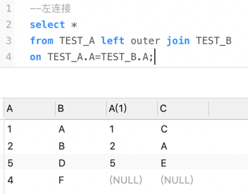

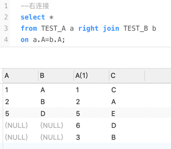

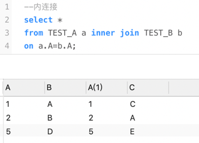

内连接与自然连接基本相同，不同之处在于自然连接只能是同名属性的等值连接，而内连接可以使用on子句来指定连接条件，连接条件中指出某两字段相等（可以不同名），例如下例。

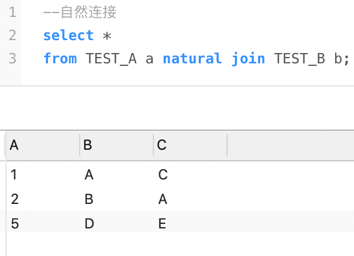

假设两张表，A表共有m行，B表共有n行，现要将两表连接，***两表连接的字段不存在空值及重复值***，思考经过笛卡尔积、左连接、右连接、内连接查询后得到的结果会有多少行。

大部分的子查询都可以用连接查询进行改写，同时使用连接查询的速度往往会更快。例如下例。

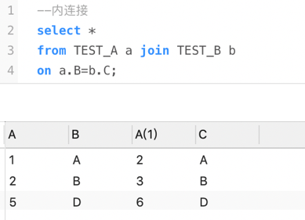

同时join连接不仅可以只连接两张表，还可以将所有同学的选课信息全部查询出来。

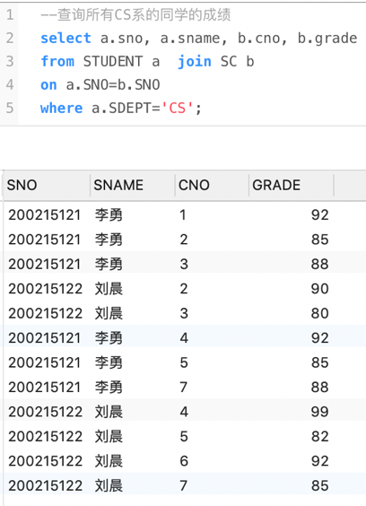

同时用于连接的表也可以是一个子查询，例如查询有成绩大于90分的同学的姓名学号。

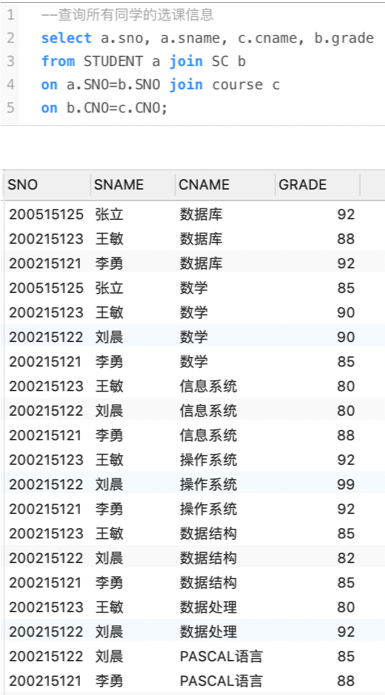

下一个例子是查询每门课的先修课的课名，如果没有先修课则为空

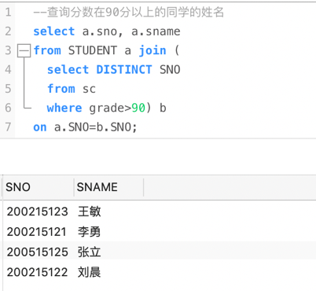

## 2. 集合查询

集合操作符可以将两个或多个查询返回的结果组合起来，常用的集合操作符包括UNION、UNION ALL、INTERSECT和MINUS。

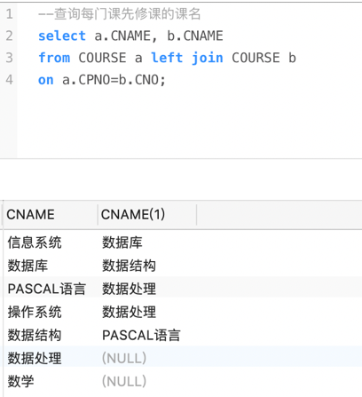

如果使用UNION ALL求并集则会保留重复的元素。

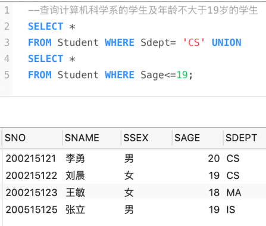

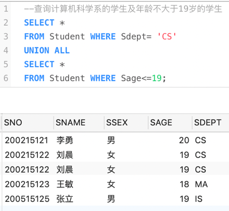

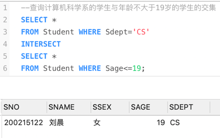

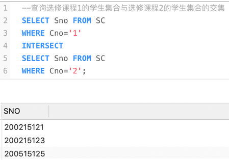

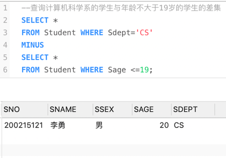

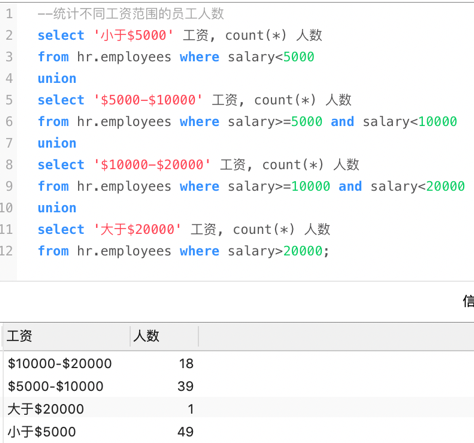

## 3. SQL优化
在select语句中避免使用*

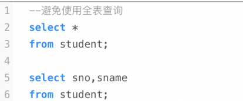

合理使用where语句中的条件

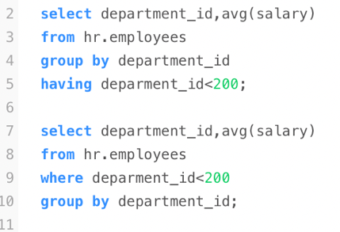

使用“<=”代替“<”

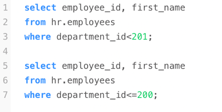

调整where语句条件的顺序

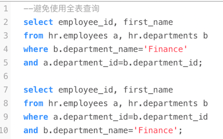

建立索引也可以提高查询效率，在这不过多赘述。

## 4. 课后作业

用查询语句完成下列查询：
1. 查询各部门的平均工资
2. 查询各部门的名称以及该部门的最高工资
3. 查询获得工资大于所有部门平均工资的员工信息
4. 查询所有在Finance部门工作的员工的姓名与工资
5. 查询月薪大于10000元的员工的姓名与工作地点
6. 查询工资比其经理工资高的员工姓名
7. 查询哪个大洲平均工资最高
8. 查询平均工资最高的部门信息*
9. 查询与Nancy同一部门的所有员工信息
10. 获取部门编号为100的所有员工信息
11. 获取工资比部门编号为100的所有员工工资高的员工姓名、工资和部门编号
12. 计算学生信息表中各个分数段的学生人数（以5分为间隔）
13. 查询工资第二高的员工的信息**

*作业提示：需要返回查询结果的前三行可以使用下列语句*

    select * from table where rownum<4;
