# 实验8 空间数据查询
## 1. 由位置选择要素，并制作图表

所需数据： idcities.shp——爱达荷州654个地点shapefile文件；snowsite.shp——爱达荷州及其毗邻州的206个滑雪站的shapefile文件。

要求用“由位置选择要素”的方法，选择距爱达荷州的Sun Valley 40英里（Miles）范围之内的滑雪站（24个），并创建一个散点图（Y字段为ELEV；X字段为SWE_MAX；标题为Elev_SweMax），输出为Elev_SweMax.jpg。

首先在ArcGIS中加载上述两个数据，右键点击Layers，选择Properties，将整个Data Frame的现实单位修改为Miles

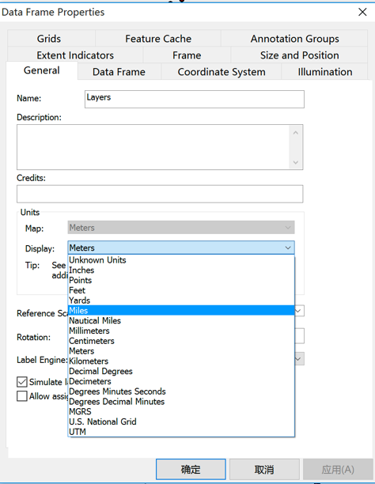

先选择出Sun Valley这个城市，点击菜单栏中的selection，选择Select by attributes，图层设置为idcities。在where中写入条件`"CITY_NAME" = 'Sun Valley'`。

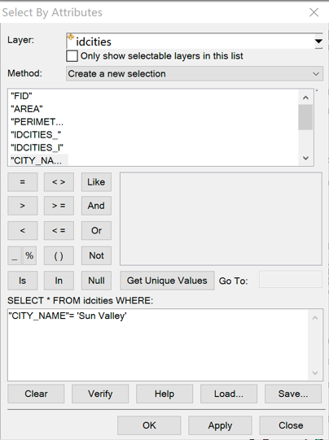

点击确定，此时将Sun Valley选择出来了。

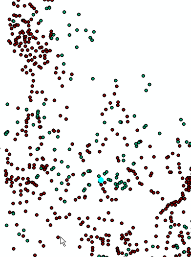

再次点击selection，选择select by location，将目标图层设置为snowsite，源图层设置为idcities，空间条件选择为within a distance，距离设为40miles。点击确定即可选择出距离Sun Valley 40 miles 的滑雪场了。

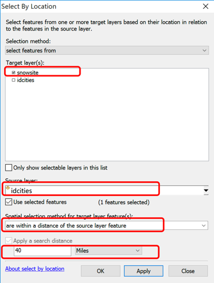

右键点击Snowsite图层，打开属性表，点击左上角的小按钮选择Create Graph创建统计图。

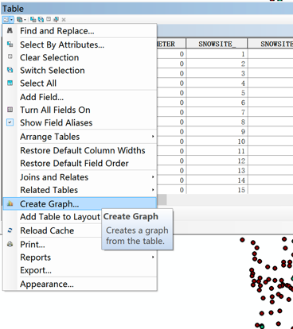

一个散点图（Y字段为ELEV；X字段为SWE_MAX）

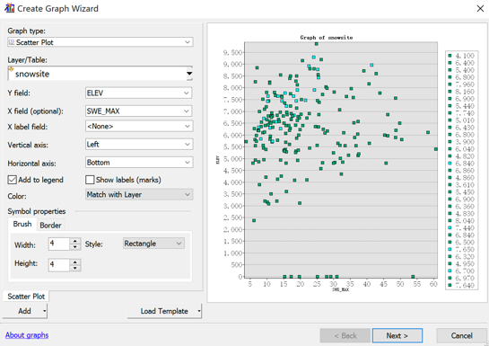

点击下一步设置标题（标题为Elev_SweMax），在此处可以选择做图的数据是全部数据还是部分选择的数据。设置完毕后点击Finish结束。

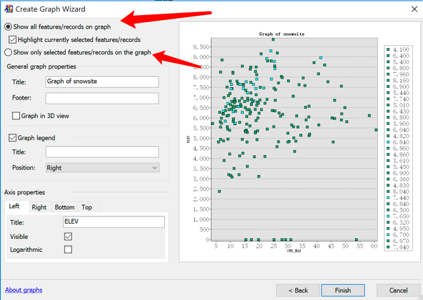
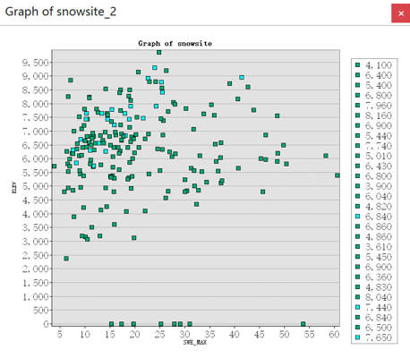

在图像上点击右键选择Export可以将图表导出为jpg格式的图片。

## 2. 由合并的属性数据表查询数据

所需数据：wp.shp，林场的shapefile文件；wpdata.dbf，含有林场数据的bBASE文件。在ArcGIS中打开上述数据。在wp图层上点击右键，选择relate and join中的join，以ID为中间字段，关联图层wp和表wpdata。

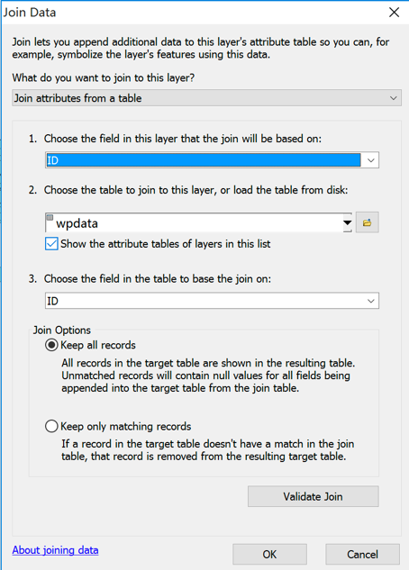

连接完成后可以执行下列查询操作。
`Select by attributes，"wpdata.ORIGIN" > 0 AND "wpdata.ORIGIN" <= 1900`，选中记录个数T1为多少？

`Select from current selection，Select by attributes，"wpdata.ELEV" <= 30`，此时选中记录个数T2为多少？

点击Clear Selected Feature清除所选要素，再次选择`Select by attributes，"wpdata.ORIGIN" > 0 AND "wpdata.ORIGIN" <= 1900 AND "wpdata.ELEV" > 40`，此时选中记录个数T3为多少？

点击Bookmarks可以创建书签记录下本次选择的数据，便于下次查看所选记录。

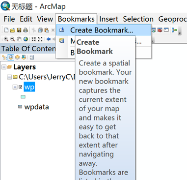

## 3. 空间与属性组合的数据查询

所需数据：thermal.shp,包含899个热井（字段TYPE=w）和泉眼（字段TYPE=s）的shapefile文件，字段temp表示水温（˚C）；idroads.shp，爱达荷州主要道路的shapefile文件。
假设某公司要在爱达荷州确定温泉胜地的候选地点，选点的两个标准为：（1）温泉必须位于主要道路2 miles范围内；（2）温泉的温度必须高于60˚C。
1. 加载数据，显示单位Display为Miles。
2. 首先选选择距离道路2miles范围内的点，使用Select by location，设置好相应表与条件，within a distance of 2 Miles. 
问题1，此时有多少温泉和热井被选中？
3. 然后再根据温度选择需要的点。使用`Select by attributes，Select from current selection，"TYPE " = 's ' AND "temp" > 60;`
4. 使用地图提示功能。右击thermal\Properties\Display，勾选Show Map Tips，提示字段选择为TEMP
问题2，距道路2mi范围内且温度高于70˚C的热井和温泉有多少个？

## 4. 栅格数据查询

所需数据：slope_gd，坡度栅格文件；aspect_gd，坡向栅格文件。加载上述数据。若未启用空间分析模块，点击Customize中的Extensions，勾选启用Spatial Analyst。
在slope_gd图层点击右键查看属性表可知，该栅格数据集中1表示坡度格网内的坡度为10˚到20˚之间，Aspect_gd也类似。

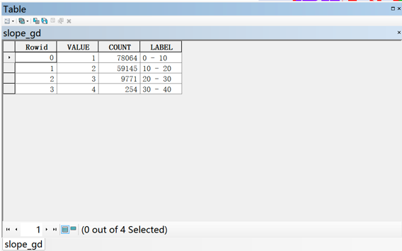

在工具箱中找到Extract by Attributes工具，编写下列条件即可查询坡度在10˚到20˚之间的地块。

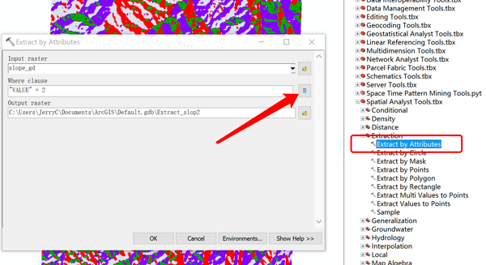

地图代数中的栅格计算器也可以完成类似的操作，尝试使用不同工具完成栅格数据的查询。

## 5. 配置Oracle数据库连接客户端

注意：本步骤仅适用于在实验1中client未安装成功的同学。如果已经安装成功并能使用SQL Developer连接数据库的同学可以跳过本步。

下载instantclient-basic-nt-12.2.0.1.0.zip并将其解压至合适的目录下。例如放在H盘根目录下。如果实验3中配置过第2步，那么可以将实验三解压的文件夹与本次解压的文件夹合并。

在系统的搜索栏搜索“环境变量”关键字，启动“编辑系统环境变量”窗口。

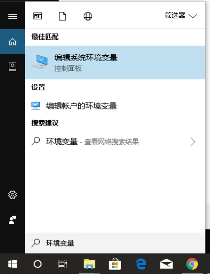

点击“环境变量”按钮。

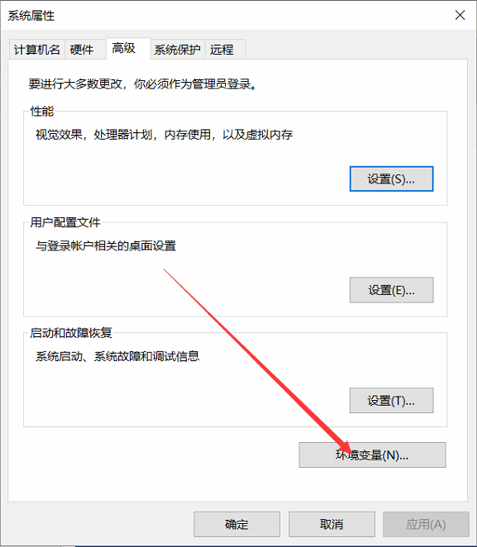

选择用户变量中的“Path”，选择编辑。

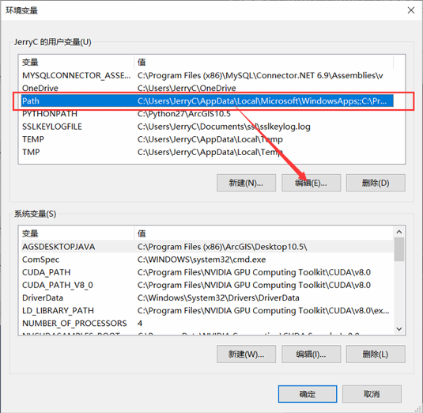

进入下列界面，点击新建，创建一条新的环境变量。

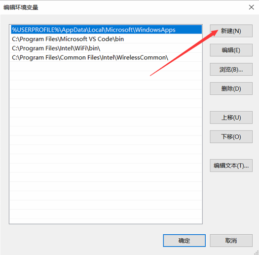

将之前解压的目录的路径复制到新建的环境变量中。

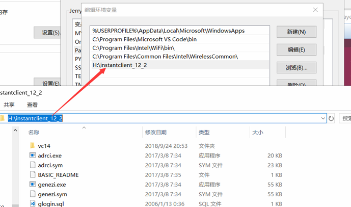

点击确定保存退出环境变量配置界面。

## 6. 使用ArcGIS连接Oracle
在ArcGIS 10.2及以后版本采用了直连的方式连接oracle数据库。采用直连方式比使用SDE方式更加稳定，特别是在大数据量处理的应用中，不易出现由SDE连接进程造成的错误。

首先启动装有Oracle的虚拟机，使用SQL Developer连接上数据库确定其能正常工作。启动ArcGIS或者ArcCatalog，找到Add Database Connection。

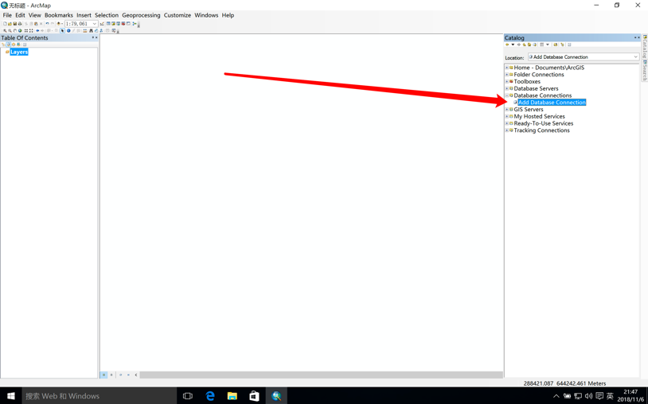

双击启动，根据ip地址设置数据库连接，注意ip地址后面要跟上实例名，这里是xe。填好登录名与密码后点击OK即可。

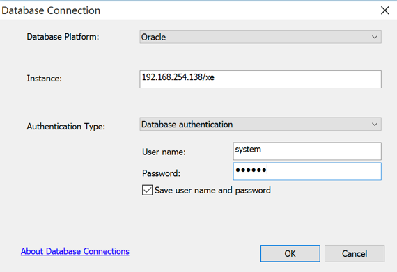

如果一切都配置正确，在Catalog中的数据连接中会生成一个连接。双击或者点击右键连接。如果这里连接错误，返回上一步检查数据库的连接器有没有设置错误。连接成功如下。

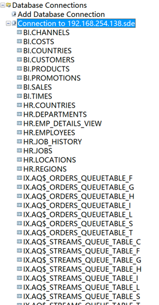

## 7. 使用ArcGIS/ArcCatalog向Oracle中导入数据
首先采用的办法是复制粘贴的办法，使用此操作时，数据格式转换等流程由数据库系统或者SDE后台自动完成。

打开实验操作提供的TEST文件夹，在Catalog内容标签中已将其数据信息列出，点击USA数据库，将其全部选中，点击“复制”。

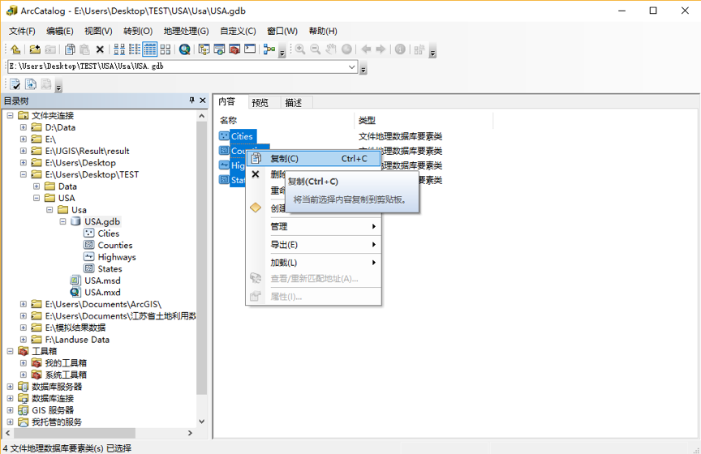

双击SDE数据库，连接数据库。并在其上右键“粘贴”，如下所示：

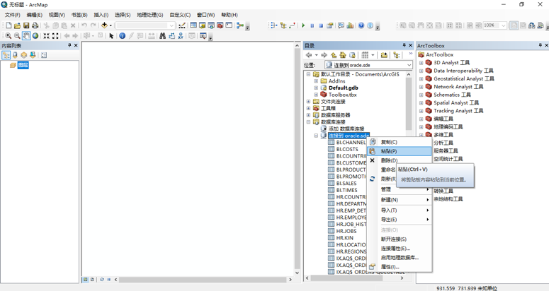

在弹出的数据库传输对方框列表中，可以看到此次需要复制的数据名称，如下所示：

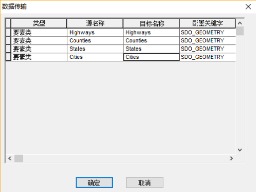

点击“确定”，将矢量图层导入SDE数据表中。此处会出现如下结果：

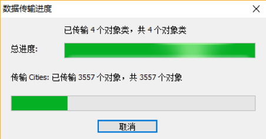

数据传输完成后，得到如下结果，可以看到本次实验所用的空间数据

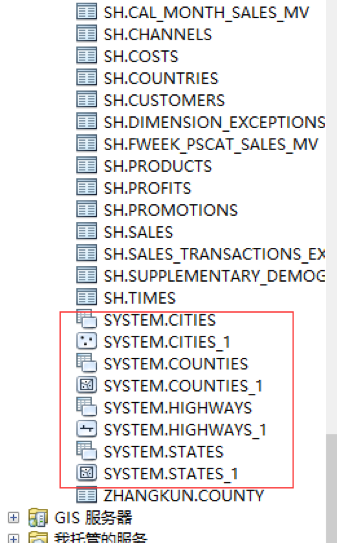

补充：当弹出粘贴失败的对话框时，证明此矢量图层在SDE中存在重名或存在问题。示例如下所示：

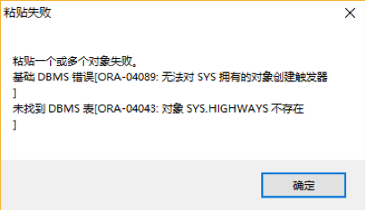

此时，我们根据对话框内容重新设定图层名称或检查数据格式，并依次进行修改，如上图中的图层不能复制粘贴入SDE库的原因在于：对象SYS.HIGHWAYS不存在等问题，查看存在的问题，解决已有的问题，确定即可。

检查数据，打开ArcCatalog的数据库连接，选择目录树栏，选择我们刚才新建的【连接到 oracle.sde】 ，首先查看本地存储的地理空间数据的分布数据，如下所示：

然后，再打开连接oracle数据库中存储在Oracle中的地理空间数据的数据存储情况，如下所示，可发现两者的数据表现情况完全一致。

当然在本实验操作过程中，有可能发现某些数据并不能使用复制粘贴的方式加载入SDE数据库中。这时，可以使用导入工具。接下里将介绍导入工具的使用。

右键点击数据库连接，选择import，可以根据需要选择一次导入一个还是一次导入多个数据集。

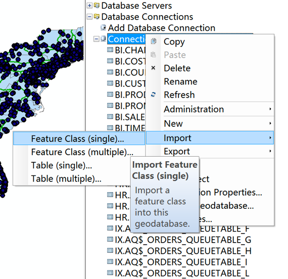

指定导入的表名，点击确定即可完成数据的导入。

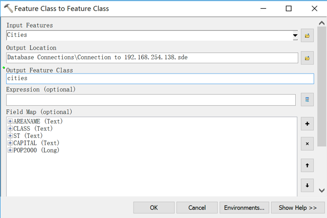

## 8. 课后作业

根据所学知识完成下列空间检索。

所需数据：cities.shp，爱达荷州194个城市的shapefile；county.shp，爱达荷州各县的shapefile；idroads.shp，爱达荷州主要道路的shapefile文件。

cities.shp有一项属性称为CityChange，用于表示1990～2000年的人口变化率。county.shp含有1990年县城人口（pop1990）和2000年县城人口（pop2000）的属性。在该文件的属性中添加新字段CoChange，用于显示各县1990～2000年的人口变化率。通过以下表达式计算CoChange的字段值：（2000年县城人口-1990年县城人口）×100/ 1990年县城人口。

* 问题1: 位于博伊西（BOISE）50miles范围内的城市的平均人口变化率是多少？

* 问题2: 与州际公路相交并且CoChange≥30的县有多少个？

* 问题3: 符合CityChange≥50的城市中，有多少个是的CoChange≥30的县域之内？
