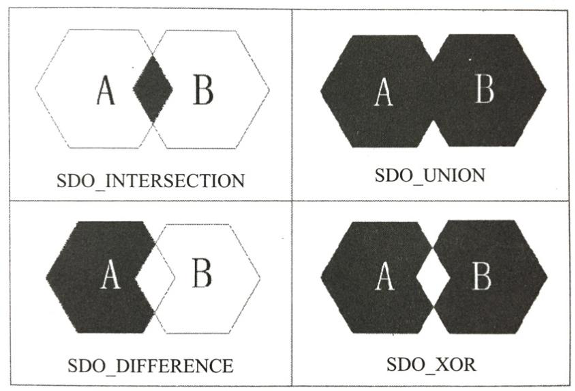

# 实验9 Oracle空间查询

## 1. 数据来源

使用实验8最后一步从ArcGIS导入数据库的数据，一共4张表：States、Cities、Highways和Counties。本套实验使用的数据库版本为Oracle 12c，因此不能支持ArcGIS 10.2及以下版本的软件。使用ArcGIS 10.2.1、10.2.2、10.3及以上版本的软件可以正常将shape文件导入到Oracle中。***如果上一个实验能完成此步，可以跳过本节剩余内容。***

使用system用户登录Oracle，使用SQL Developer打开实验9附带的文件夹中的main.sql。

点击运行按钮即可完成数据表的创建以及数据集的导入。使用此方法导入数据可能会因为电脑的配置与系统设置不同出现少许数据不能导入，尚无解决方法，建议条件允许，使用合适版本的ArcGIS导入数据。另外，经测试，Navicat并不能正常地查询空间数据，有极大可能性会直接闪退，尚无解决办法。本实验建议使用ArcGIS 10.3与SQL Developer。

## 2. 属性查询

与空间处理相关的函数以及程序包都在mdsys用户中，可以登录mdsys查看相关函数与文档。如果无法登录，请登录管理页面重置该账户。

点开一张空间表查看其表结构，与普通数据表类似，地理数据表也有各自的属性列，这与我们在ArcMap中点击右键查看的属性表一致，唯一不同的是它还有一列表示地理信息的列。按照习惯我们通常为其起名为shape。

空间数据表的查询与普通表的查询类似，例如：

## 3. 简单空间查询

## 4. 高级空间查询

缓冲函数sdo_buffer可以构建缓冲区，与ArcGIS中的缓冲区工具类似，可以对点线面构建缓冲区。

***该代码运行时间会很长！***

上述代码运行完成后会将查询结果储存到一张新表中，如果ArcGIS能正常连接Oracle，那么可以将数据导出并可视化。

关系分析函数Relate。该函数主要计算两个区域间存在的共同数据信息，其函数结构为：

    RELATE(
    Geometry_A  in SDO_GEOMETRY,
    Mask        in VARCHAR2,
    Geometry_B  in SDO_GEOMETRY,
    Tolerance     in NUMBER
    )

1. Geometry_A和Geometry_B表示两个几何体。

2. Mask参数可有下面几种选择

* **Anyinteract**: Geometry_B落在Geometry_A面上包括在边上。 

* **Contains**: Geometry_B完全包含在Geometry_A几何对象中，并且两个几何对象的边没有交叉。 

* **Coveredby**: Geometry_A完全包含在Geometry_B中，并且这两个几何对象的边有一个或多个点相互重叠。 

* **Covers**: Geometry_B完全包含在Geometry_A中，并且这两个几何对象的边有一个或多个点相互重叠。 

* **Disjoint**: 两个几何没有重叠交叉点，也没有共同的边。 

* **Equal**: 两个几何是相等的。 

* **Inside**: Geometry_A完全包含在Geometry_B几何对象中，并且两个几何对象的边没有交叉。 

* **On**: Geometry_A的边和内部的线完全在Geometry_B上。 

* **Overlapbdydisjoint**: 两个几何对象交迭，但是边没有交叉。 

* **Overlapbdyintersect**: 两个几何对象交迭，并且边有部分交叉。 

* **Touch**: 两个几何对象有共同的边，但没有交叉。
  

3. 返回值如下

如果两个几何体满足Mask指定的关系时，返回Mask的值，反之返回False；若两个几何体相关且Mask指定了Anyinteract，则返回True，反之返回False。

几何组合函数SDO_INTERSECTION、SDO_UNION、SDO_DIFFERENCE与SDO_XOR，几个函数的表现形式如下：

这四个函数的语法结构如下：

    SDO_xxxx(
        Geometry_A  in SDO_GEOMETRY,
        Geometry_B  in SDO_GEOMETRY,
        Tolerance   in NUMBER
    )

## 5. OGIS标准的函数

因为由ArcGIS导入的数据在Oracle中使用的是SDO_GEOMETRY类型几何类型，因此无法直接使用Oracle中自带的OGIS标准的函数，但是可以转化类型后再使用。
例如：

## 6. 课后作业

完成下列空间查询：
1. 美国哪个/些州与其相邻的州最多？

2. 70号公路穿过了几个州？
   
3. 90号公路附近100公里内的城市的名字
